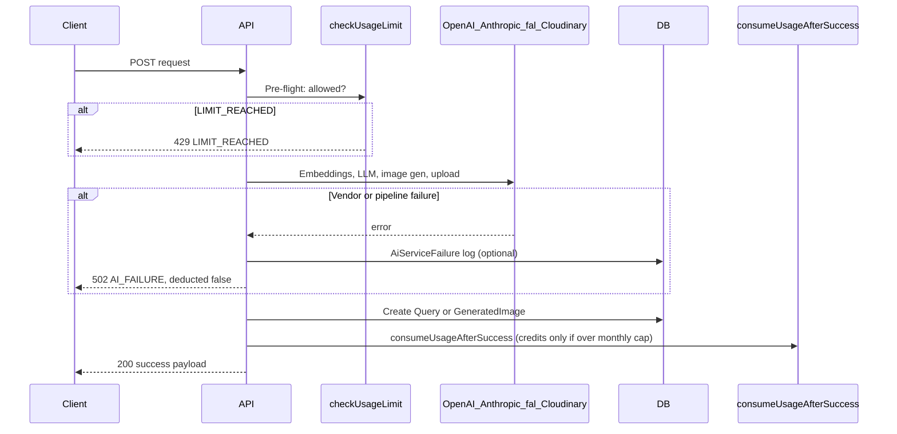

# AI vendor failures and quota protection

This document explains how NovelViz ensures **users are not charged** (monthly allowance, credits, or partner-specific quotas) when an upstream AI or media vendor call fails. Use it when extending Q&A, image generation, cover AI, or any new paid AI feature.

Related docs:

- [quota-and-credit-plan.md](./quota-and-credit-plan.md) — product rules for tiers, credits, and billing
- [payment-credit-system-report.md](./payment-credit-system-report.md) — ledger models and Stripe integration

---

## Design principle

**Usage is only consumed after a successful, user-visible outcome is persisted.**

Vendor calls (OpenAI embeddings, Anthropic text, fal.ai image generation, Cloudinary upload) happen *before* any quota or credit is applied. If any step in the pipeline fails, the handler returns early **without** creating the success record that drives usage counting, and **without** calling credit spend helpers.

There is no separate “refund” step — failures simply never reach the charge path.

---

## What counts as “usage”

NovelViz tracks reader usage in two layers:

| Layer | How it is measured | When it changes |
|-------|-------------------|-----------------|
| **Monthly allowance** | Count of `Query` or `GeneratedImage` rows for the user since `usagePeriodStart` | Increments when a row is **created** (one successful Q&A or image) |
| **Credits (overage)** | Sum of `CreditTransaction.amount` for the user | Decrements only via `spendCreditsIfNeeded()` when monthly allowance is already exhausted |

Monthly allowance is **not** stored in a separate counter column. It is derived at check time from DB row counts (`countMonthlyUsage` in `lib/subscription.ts`).

Credits are **not** spent at the start of a request. They are spent in `consumeUsageAfterSuccess()` **after** the success row exists, and only if the user is already over their monthly limit.

Legacy `UserGrant` top-ups (pre-ledger `PURCHASE` bonuses) follow the same rule: `consumeTopUp()` runs only inside `consumeUsageAfterSuccess()`, after success.

---

## Request lifecycle (reader Q&A and Imagine)

Both `POST /api/query` and `POST /api/imagine` follow the same pattern.



### Step 1 — Pre-flight gate (`checkUsageLimit`)

**Files:** `lib/subscription.ts`, called from `app/api/query/route.ts` and `app/api/imagine/route.ts`

Before any vendor work:

1. Resolve effective tier limits (`getEffectiveLimits`) from DB tier config, floors, grants, and admin overrides.
2. Count current-period usage from existing `Query` / `GeneratedImage` rows.
3. Allow the request if:
   - User is **admin** (unlimited), or
   - Monthly usage is below limit, or
   - User has enough **credits** (or legacy top-up balance) to cover overage, or
   - `BETA_MODE=true` (development bypass — always allowed, no credit spend flag)

If not allowed → **`429`** with `error: "LIMIT_REACHED"` (distinct from vendor failure).

**Important:** Passing this check does **not** deduct anything. It only answers “may this request proceed?”.

### Step 2 — Vendor pipeline (failure = no charge)

Work is split into try/catch blocks. Any failure returns `aiFailureResponse()` and **exits before** creating `Query` / `GeneratedImage`.

#### `POST /api/query` failure points

| Stage | Vendor | On failure |
|-------|--------|------------|
| Question embedding | OpenAI (via `embedChunksWithTokenUsage`) | `aiFailureResponse` |
| Vector search | Postgres/pgvector | `aiFailureResponse` |
| Answer generation | Anthropic (`anthropic.messages.create`) | `aiFailureResponse` |
| Empty model output | — | `aiFailureResponse` |

#### `POST /api/imagine` failure points

| Stage | Vendor | On failure |
|-------|--------|------------|
| Subject extraction | Anthropic | `aiFailureResponse` |
| Embeddings (prompt + subject) | OpenAI | `aiFailureResponse` |
| Vector search | Postgres/pgvector | `aiFailureResponse` |
| Prompt enrichment | Anthropic | `aiFailureResponse` |
| Image generation | fal.ai (`fal.subscribe`) | `aiFailureResponse` |
| Persist to CDN | Cloudinary | `aiFailureResponse` |

Because no row is inserted on failure, **monthly usage count is unchanged**.

### Step 3 — Success persistence

Only after the full pipeline succeeds:

- **Q&A:** `prisma.query.create(...)` with question, answer, token counts.
- **Imagine:** `prisma.generatedImage.create(...)` with prompts, URL, token counts.

These rows are what future `checkUsageLimit` calls count toward the monthly allowance.

### Step 4 — Credit spend (`consumeUsageAfterSuccess`)

**File:** `lib/subscription.ts` → `consumeUsageAfterSuccess()`

Called **after** the success row is created. Logic:

1. If monthly limit is `null` (unlimited) **or** `monthlyUsed <= limit` → **return immediately** (allowance covers it; no credits).
2. Else if credit balance ≥ cost → `spendCreditsIfNeeded()` writes a negative `CreditTransaction` (`SPEND_QUERY` or `SPEND_IMAGE`).
3. Else → fall back to legacy `consumeTopUp()` on `UserGrant` rows.

If this function throws, the error is logged but the API still returns success to the client — the user keeps the Q&A/image row. That is a rare inconsistency (success delivered, credit maybe not spent); it does **not** double-charge.

---

## Central failure helper (`aiFailureResponse`)

**Files:**

- `lib/ai-service-failure.ts` — `reportAiServiceFailure()`, `aiFailureResponse()`
- `lib/ai-failure-constants.ts` — shared user-facing copy

On vendor failure, routes call:

```ts
return aiFailureResponse(userId, "/api/query", bookId, error);
```

Behavior:

1. **Logs** a row to `AiServiceFailure` (user, route, optional `bookId`, error summary). Logging failures are caught and written to server console only — they do not affect the HTTP response.
2. **Returns HTTP 502** with JSON:

```json
{
  "error": "AI_FAILURE",
  "message": "Oops — something went wrong on our end. We've reported it to the site admin. This will not be deducted from your allowance or credits.",
  "deducted": false
}
```

Schema comment in `prisma/schema.prisma`:

> Logged when AI upstream fails — not deducted from quota.

There is **no** compensating transaction because nothing was deducted in the first place.

---

## Client UX

**File:** `app/(reader)/(app)/library/library-book-panel.tsx`

For both Ask and Imagine submits:

- `LIMIT_REACHED` → quota exhausted modal (`QuotaExhaustedModal`) with upgrade / credit context.
- `AI_FAILURE` → dedicated modal (`AiFailureNotice`), **not** a generic error string.
- Other errors → inline error message.

**File:** `components/subscription/ai-failure-notice.tsx`

Displays the message from `AI_FAILURE_MESSAGE` or the API’s `message` field.

When extending new surfaces (mobile, dashboard, partner tools), preserve the **`error === "AI_FAILURE"`** branch so users always see the “not deducted” reassurance.

---

## Partner cover AI (separate quota model)

**File:** `app/api/books/[id]/cover-ai/generate/route.ts`

Publisher cover generation uses **per-book** allowance (`Book.coverGenAttemptsGranted` / `coverGenAttemptsConsumed`), not reader tier limits.

Same principle, different implementation:

1. Check quota **before** calling fal (`429` with `COVER_AI_QUOTA_EXHAUSTED` if exhausted).
2. Call fal.ai, then upload to Cloudinary.
3. **Only after both succeed:** `coverGenAttemptsConsumed: { increment: 1 }`.
4. On fal or Cloudinary failure → `502` with a generic error; **attempt counter is not incremented**.

Admins are quota-exempt (`resolveCoverAiQuotaExempt` in `lib/cover-ai-access.ts`).

**Gap to be aware of when extending:** Cover AI does **not** yet use `aiFailureResponse()` or write `AiServiceFailure` rows. Reader Q&A/Imagine are the reference implementation for admin failure monitoring.

---

## Admin and monitoring

| Mechanism | Purpose |
|-----------|---------|
| `AiServiceFailure` table | Audit trail of reader AI pipeline failures (route, user, book, error snippet, timestamp) |
| Server logs | `[api/query POST]`, `[api/imagine POST]`, `[cover-ai generate]` prefixed errors |
| `deducted: false` in API | Lets clients and future tooling assert no charge occurred |

There is no automated admin email on failure today; failures are queryable from the DB and logs. When expanding the system, consider reusing `reportAiServiceFailure()` for any new vendor-backed route.

---

## Rules for adding new AI features

1. **Never** call `spendCreditsIfNeeded`, `consumeUsageAfterSuccess`, or increment quota counters before the user-visible success artifact exists in the DB (or the relevant quota field is updated).
2. **Always** run `checkUsageLimit` (or the feature-specific quota check) at the **start** of the handler.
3. **Wrap each vendor step** (or the whole pipeline) so failures return early without persistence.
4. **Prefer** `aiFailureResponse()` for reader-facing features so logging and copy stay consistent.
5. **Return structured errors:** `LIMIT_REACHED` (429) vs `AI_FAILURE` (502) vs validation errors (400) — do not mix them.
6. **Count usage from durable success records**, not from “request started” events.

Suggested template:

```ts
const limitCheck = await checkUsageLimit(userId, "query"); // or "image"
if (!limitCheck.allowed) {
  return NextResponse.json({ error: "LIMIT_REACHED", ... }, { status: 429 });
}

try {
  // ... vendor pipeline ...
} catch (e) {
  return aiFailureResponse(userId, "/api/your-route", bookId, e);
}

await prisma.query.create({ ... }); // or generatedImage.create

try {
  await consumeUsageAfterSuccess(userId, "query", bookId);
} catch (err) {
  console.error("[your-route] consumeUsageAfterSuccess error", err);
}

return NextResponse.json({ ... });
```

---

## Quick reference — key files

| File | Role |
|------|------|
| `lib/subscription.ts` | `checkUsageLimit`, `consumeUsageAfterSuccess`, billing period, effective limits |
| `lib/credits.ts` | `getCreditBalance`, `spendCreditsIfNeeded`, credit ledger |
| `lib/ai-service-failure.ts` | Failure logging + `aiFailureResponse` |
| `lib/ai-failure-constants.ts` | User-facing “not deducted” message |
| `app/api/query/route.ts` | Q&A pipeline + charge-after-success |
| `app/api/imagine/route.ts` | Imagine pipeline + charge-after-success |
| `app/api/books/[id]/cover-ai/generate/route.ts` | Partner cover quota increment after success |
| `prisma/schema.prisma` | `Query`, `GeneratedImage`, `CreditTransaction`, `AiServiceFailure` |

---

## Summary

- **Monthly allowance** = number of successful `Query` / `GeneratedImage` rows in the billing period.
- **Credits** = spent only in `consumeUsageAfterSuccess`, after those rows exist, and only when over monthly cap.
- **Vendor failures** = no row created, no credit spend, optional `AiServiceFailure` log, client sees `AI_FAILURE` with `deducted: false`.
- **Pre-flight `checkUsageLimit`** prevents starting work when the user cannot pay — but does not consume quota by itself.

When extending this system, copy the **charge-after-success** ordering from `/api/query` and `/api/imagine`; do not introduce “reserve then commit” logic unless you also implement explicit rollback on failure.
