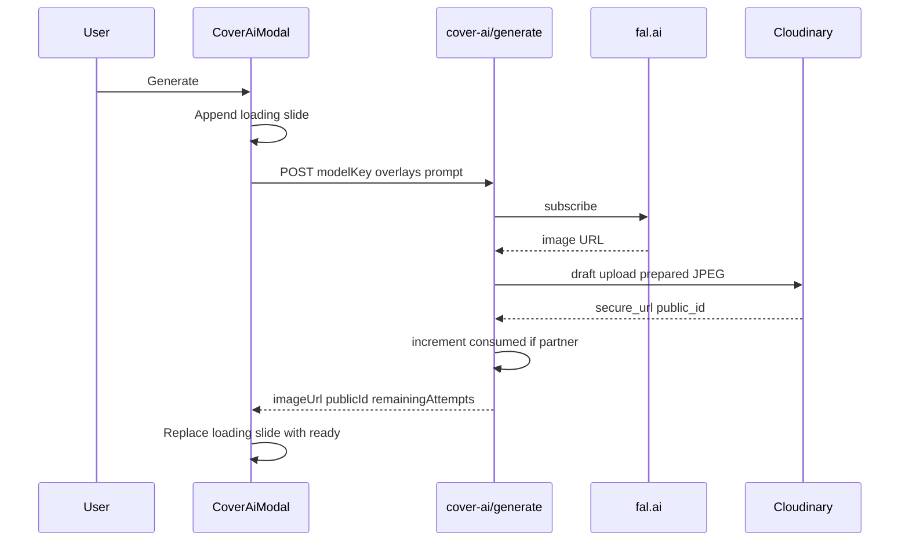

# Book cover AI generation — codebase guide

Reference for Claude and other agents working on NovelViz **publisher cover AI** (fal.ai → Cloudinary drafts → commit to book cover). This is **not** the Library **Imagine** feature (`POST /api/imagine`); see [`image-generation-ui-context.md`](./image-generation-ui-context.md) for that parallel flow.

---

## What it does

Partners (and admins) generate **portrait 3:4** cover candidates for a book, preview up to **five** drafts in a modal carousel, then **commit one** as the official `Book.coverImageUrl`. Drafts live in Cloudinary under a per-book folder until committed or discarded.

---

## Entry points (UI)

| Surface | File | How the modal opens |
|--------|------|---------------------|
| Partner book detail | [`app/(partner)/partner/books/[id]/partner-book-detail-client.tsx`](../app/(partner)/partner/books/[id]/partner-book-detail-client.tsx) | “Generate AI cover” button → `CoverAiModal` |
| Admin book detail | [`app/admin/books/[id]/admin-book-detail-client.tsx`](../app/admin/books/[id]/admin-book-detail-client.tsx) | Same modal; shows publisher quota panel when `book.ownerLabel` is set |
| After create book | [`app/(partner)/partner/books/new/new-book-form.tsx`](../app/(partner)/partner/books/new/new-book-form.tsx) | Optional checkboxes → redirect `?openCoverAi=1&coverIncludeTitle=1&coverIncludeAuthor=1` |

Admin prompt/model configuration: [`app/admin/cover-ai-settings/`](../app/admin/cover-ai-settings/) → `GET/PATCH /api/admin/cover-ai-settings`.

---

## Core UI component

**[`components/cover-ai/cover-ai-modal.tsx`](../components/cover-ai/cover-ai-modal.tsx)** — client modal; all cover-AI UX logic lives here.

### Form fields

- **Model** — dropdown from config (`modelKey`).
- **Your description** — required publisher prompt (`publisherPrompt`); combined prompt must be ≥ 8 chars server-side.
- **Book title on cover** / **Author on cover** — optional overlay strings (`overlayTitle`, `overlayAuthor`). Empty → those blocks are **omitted** from the fal prompt (see [`lib/cover-ai-prompt.ts`](../lib/cover-ai-prompt.ts)).
- **Generate** / **Regenerate (add another)** — triggers generation.
- **Use this as cover** — commits the carousel’s current **ready** slide.

Loading state uses [`components/ui/image-generation-loader.tsx`](../components/ui/image-generation-loader.tsx) inside the preview frame (not a full-screen overlay).

### Create-book overlay flags

`overlayIncludes?: { title: boolean; author: boolean }` — when opening from create flow, if `title` or `author` is false, modal leaves overlay fields empty so prompt assembly skips text on the cover.

---

## Five-preview carousel (`CAROUSEL_MAX = 5`)

This is a **client-side session limit**, separate from partner **quota** (database attempts).

### Slide model

```ts
type DraftSlide =
  | { kind: "loading"; slotId: string }
  | { kind: "ready"; slotId: string; imageUrl: string; publicId: string };
```

- **`loading`** — added immediately when user clicks Generate; shows `ImageGenerationLoader` in the portrait preview (`aspect-[3/4] max-w-xs`).
- **`ready`** — after successful `POST .../cover-ai/generate`; shows Cloudinary draft image.

### Rules

| Rule | Behavior |
|------|----------|
| Max **ready** previews | `readySlideCount(slides) >= 5` → block Generate with error: choose a cover or close to discard |
| Loading slides | Do **not** count toward the 5 cap (only `kind === "ready"`) |
| Carousel | Previous/Next + swipe; label “Preview N / total (max 5 saved)” |
| Failed generation | Loading slide **removed**; no quota charge (see below) |
| Close modal without commit | Confirm if any slides or in-flight generate; **best-effort** `discard-drafts` for all **ready** `publicId`s |
| Commit | One chosen draft → official cover; **all** ready drafts (chosen + others) destroyed in Cloudinary via commit route |

### Important distinction

- **5 previews** = how many draft images you can **keep open at once** in the modal this session.
- **Quota** = how many **successful generations** a partner may run per book (default 5 granted, tracked in DB). Admins do not consume quota.

You can have fewer than 5 ready previews while quota is exhausted, or hit the 5-preview cap while quota remains (must commit or close to free slots).

---

## Partner quota (database)

### Fields on `Book` ([`prisma/schema.prisma`](../prisma/schema.prisma))

- `coverGenAttemptsGranted` — default **5**; admin can raise via `PATCH /api/admin/books/[id]` (`coverGenAttemptsGranted` or `coverGenAttemptsGrantedDelta`).
- `coverGenAttemptsConsumed` — incremented by **1** only after a **successful** generate **and** Cloudinary upload (not on fal-only success, not on failure).

`remainingAttempts = max(0, granted - consumed)`.

### Who is quota-exempt

[`lib/cover-ai-access.ts`](../lib/cover-ai-access.ts) — `resolveCoverAiQuotaExempt({ role })` returns **true for all admins**. Partners are never exempt.

- Modal hides quota UI when `quotaExempt` from config.
- Generate route skips pre-check and post-increment when exempt.

### Request more

`POST /api/books/[id]/cover-ai/request-more` — partner only when `consumed >= granted`; creates `CoverAiQuotaRequest` if none pending. Admin granting more attempts (or `resetCoverGenQuota: true` on admin PATCH) marks pending requests handled.

### Admin manage book page

Publisher allowance panel: used/consumed/remaining + **Reset publisher allowance** (`resetCoverGenQuota: true` → `coverGenAttemptsConsumed = 0`, clears pending requests).

---

## Access control

[`canAccessBookCoverAi(role, dbUserId, book)`](../lib/cover-ai-access.ts):

- **Admin** — any book.
- **Partner** — only if `book.ownerId === dbUser.id`.

All routes under `/api/books/[id]/cover-ai/*` use Clerk session → `resolveDbUserFromSession`.

---

## API routes

Base: `/api/books/[bookId]/cover-ai/`

| Method | Path | Purpose |
|--------|------|---------|
| GET | `config` | Models, prompt suggestions (title/author), quota fields, `hasPendingQuotaRequest` |
| POST | `generate` | fal generate + draft upload; returns `imageUrl`, `publicId`, `remainingAttempts` |
| POST | `commit` | Publish chosen draft to `novelviz/covers/{bookId}`; update `coverImageUrl`; destroy drafts |
| POST | `discard-drafts` | Destroy draft `publicId`s (modal close cleanup) |
| POST | `request-more` | Partner quota exhaustion request |

`generate` has `maxDuration = 300` (long fal runs).

### Generate pipeline ([`generate/route.ts`](../app/api/books/[id]/cover-ai/generate/route.ts))

1. Validate `modelKey`, access, quota (if partner).
2. `assembleCoverAiPrompt` from admin settings + overlays + publisher text.
3. `fal.subscribe` via [`lib/cover-ai-fal.ts`](../lib/cover-ai-fal.ts) (portrait 3:4 per model profile).
4. `uploadFalImageUrlToCloudinary` → [`lib/upload-prepared-image-to-cloudinary.ts`](../lib/upload-prepared-image-to-cloudinary.ts) (sharp resize/JPEG, &lt; 10MB) → folder **`novelviz/cover-drafts/{bookId}`**, `public_id` = random UUID.
5. If not quota-exempt: `coverGenAttemptsConsumed += 1`.

### Commit pipeline ([`commit/route.ts`](../app/api/books/[id]/cover-ai/commit/route.ts))

1. Validate `chosenPublicId`, `chosenImageUrl` (must be Cloudinary HTTPS under `cover-drafts/{bookId}/`).
2. Re-upload chosen URL to **`novelviz/covers`** with `public_id = bookId`, transform 400×600 fit.
3. `Book.coverImageUrl` updated.
4. Destroy chosen + `discardPublicIds` in Cloudinary (best-effort).

Draft prefix validation: [`isCoverAiDraftPublicIdForBook`](../lib/cover-ai-access.ts) — `novelviz/cover-drafts/{bookId}/...`.

---

## Prompt assembly

[`lib/cover-ai-settings.ts`](../lib/cover-ai-settings.ts) — singleton `CoverAiAdminSettings` (id `"default"`):

- `basePromptPrefix`, `titlePromptTemplate`, `authorPromptTemplate`
- `modelsJson` — array of `{ key, label, falEndpoint, inputProfile }`

Default models: **flux-schnell**, **grok**, **seedream-v45** ([`lib/cover-ai-fal.ts`](../lib/cover-ai-fal.ts) maps `inputProfile` to fal input shape).

[`assembleCoverAiPrompt`](../lib/cover-ai-prompt.ts):

1. Base prefix (if non-empty)
2. Title block only if `overlayTitle` trimmed non-empty → template with `{{title}}`
3. Author block only if `overlayAuthor` trimmed non-empty → `{{author}}`
4. Publisher description (required for useful output)

---

## Client generate flow (sequence)



---

## Common mistakes (for agents)

1. **Confusing with Library Imagine** — different API, folder (`novelviz/gallery`), no carousel, no book quota fields.
2. **Assuming quota increments on Generate click** — only after successful Cloudinary draft upload.
3. **Assuming 5 previews = 5 quota** — carousel cap is UI-only; quota is DB `consumed`/`granted`.
4. **Counting loading slides toward 5** — only `ready` slides count.
5. **Looking for spinner in `reader/[bookId]`** — reader route has no cover AI.
6. **`isCoverAiQuotaExemptEligible`** — legacy helper on book status; **exempt is admin role only** via `resolveCoverAiQuotaExempt`.
7. **Commit without draft path** — final cover is `novelviz/covers/{bookId}`, not draft folder.

---

## Related files (quick index)

| Area | Path |
|------|------|
| Modal UI | `components/cover-ai/cover-ai-modal.tsx` |
| Access / draft paths | `lib/cover-ai-access.ts` |
| Prompt | `lib/cover-ai-prompt.ts` |
| fal models | `lib/cover-ai-fal.ts`, `lib/cover-ai-settings.ts` |
| Upload helper | `lib/upload-prepared-image-to-cloudinary.ts` |
| APIs | `app/api/books/[id]/cover-ai/*` |
| Admin settings UI | `app/admin/cover-ai-settings/` |
| Admin quota PATCH | `app/api/admin/books/[id]/route.ts` |
| Migration | `prisma/migrations/20260526120000_cover_ai/` |

---

## When changing behavior

- **Carousel cap** — `CAROUSEL_MAX` in `cover-ai-modal.tsx` only (unless product also wants DB alignment).
- **Default granted attempts** — schema default + seed; admin PATCH for per-book overrides.
- **New fal model** — `cover-ai-settings` defaults + `inputProfile` in `cover-ai-fal.ts` + admin settings UI.
- **Loader visual** — `ImageGenerationLoader`; do not change generate/commit logic.
- **Large Seedream PNGs** — already handled by `prepareFalImageBufferForCloudinary` before Cloudinary upload.
