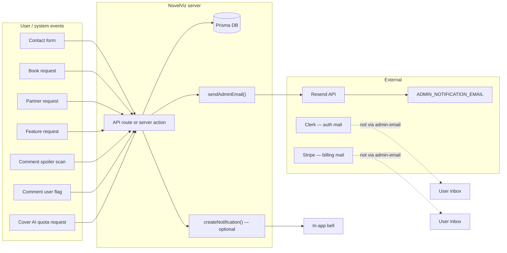

# Email integration

This document explains how email works in NovelViz today — what the app sends, what external services send, configuration, and how to add new admin notifications safely.

---

## Summary

NovelViz uses **one outbound email pipeline** for application code:

| Layer | Technology | Purpose |
|-------|------------|---------|
| **App → admin inbox** | [Resend](https://resend.com) via `lib/admin-email.ts` | Plain-text operational alerts |
| **Auth emails** | Clerk | Verification, password reset, magic links (not implemented in app code) |
| **Billing emails** | Stripe | Receipts, subscription lifecycle (not implemented in app code) |
| **User alerts** | In-app notifications (`lib/notifications.ts`) | Bell icon in nav — **not email** |

There are **no user-facing transactional emails** sent from NovelViz server code today (no “welcome”, “your comment was approved”, etc.). Those flows use **in-app notifications** and/or Clerk/Stripe.

AI service failures are **not** emailed; they are stored in `AiServiceFailure` and shown in the admin dashboard (see `docs/ai-failure-quota-protection.md`).

---

## Core module: `lib/admin-email.ts`

All Resend traffic goes through this file. Do not call Resend directly elsewhere.

### Public API

| Export | Purpose |
|--------|---------|
| `sendAdminEmail(input)` | Fire-and-forget send; **never throws** to callers |
| `AdminEmailCategory` | Subject prefix tag (see categories below) |
| `buildAdminEmailSubject(category, detail)` | `[CATEGORY] - detail` (detail truncated to 120 chars) |
| `buildAdminEmailBody(bodyLines)` | `Label: value` lines joined with `\n` |
| `getAppBaseUrl()` | Base URL for link construction |
| `absoluteAppUrl(path)` | Absolute URL for admin links in email bodies |
| `CONTACT_SUBJECT_LABELS` | Contact form enum → readable label |

### Input shape

```ts
sendAdminEmail({
  category: AdminEmailCategory.CONTACT,
  subjectDetail: "General enquiry - Jane Doe",
  replyTo: "user@example.com",  // optional — only CONTACT uses this today
  bodyLines: [
    { label: "Name", value: "Jane Doe" },
    { label: "Message", value: "..." },
  ],
});
```

### Email format

- **Plain text only** — no HTML templates, no attachments.
- **Subject**: `[CATEGORY] - {subjectDetail}`
- **To**: single address from `ADMIN_NOTIFICATION_EMAIL`
- **From**: `EMAIL_FROM` (must be a verified Resend sender/domain)
- **Reply-To**: set when provided (contact form sets visitor email)

### Runtime behaviour (important for local dev)

Sending is **best-effort** and **non-blocking**:

1. If `ADMIN_NOTIFICATION_EMAIL` or `EMAIL_FROM` is missing → logs `[admin-email] skipped` and returns.
2. If `RESEND_API_KEY` is missing → logs `[admin-email] would send` with full payload (no API call).
3. If Resend returns an error → logs `[admin-email] send failed`; caller is unaffected.
4. Unexpected promise rejection → caught and logged.

**API routes and server actions return success to the user even when email fails or is skipped.** Persistence (DB writes) happens before `sendAdminEmail` in all current call sites.

### Resend client

- Singleton `Resend` instance lazily created from `RESEND_API_KEY`.
- Package: `"resend": "^6.12.4"` in `package.json`.

---

## Environment variables

| Variable | Required to send | Purpose |
|----------|------------------|---------|
| `RESEND_API_KEY` | Yes | Resend API authentication |
| `ADMIN_NOTIFICATION_EMAIL` | Yes | Destination inbox (e.g. `hello@novelviz.com`) |
| `EMAIL_FROM` | Yes | Verified sender (e.g. `NovelViz <notifications@novelviz.com>`) |
| `NEXT_PUBLIC_APP_URL` | Recommended | Canonical site URL for links in email bodies |

Fallback for base URL when `NEXT_PUBLIC_APP_URL` is unset:

1. `https://${VERCEL_URL}` (Vercel deployments)
2. `http://localhost:3000`

Documented in `docs/database-environments.md` for Production, Development, and `.env.local` examples.

---

## Admin email categories and triggers

Each category maps to a product event. All paths persist data first, then call `sendAdminEmail`.

| Category | Constant | Trigger | Caller | UI entry |
|----------|----------|---------|--------|----------|
| Contact | `CONTACT` | Public contact form submit | `POST /api/contact` | `/contact` → `ContactBlock` |
| Book request | `BOOK-REQUEST` | Reader requests a title be added | `POST /api/requests` | `BookRequestModal` |
| Partner request | `PARTNER-REQUEST` | Reader applies for partner access | `POST /api/partner-requests` | Dashboard partner section |
| Partner request (onboarding) | `PARTNER-REQUEST` | User checks partner interest on plan step | `completePlanStep()` in `lib/onboarding-plan-action.ts` | Onboarding `/onboarding/plan` |
| Feature request | `FEATURE-REQUEST` | Partner/admin asks to feature a gallery image | `POST /api/feature-requests` | Partner book detail, dashboard feature images |
| Spoiler flag | `SPOILER-FLAG` | AI comment scan flags possible spoiler | `scanCommentForSpoilers()` in `lib/comment-scan.ts` | Automatic on comment POST/edit |
| Comment flag | `COMMENT-FLAG` | Reader reports inappropriate comment | `POST /api/comments/[commentId]/flag` | Gallery comment UI |
| Cover AI quota | `COVER-AI-REQUEST` | Partner exhausts cover gen allowance | `POST /api/books/[id]/cover-ai/request-more` | Cover AI modal |

### Per-trigger details

#### Contact (`CONTACT`)

- **Auth**: Public (no login).
- **Validation**: name, email format, subject enum, message ≥ 20 chars.
- **Reply-To**: submitter’s email so admin can reply from mail client.
- **DB**: None — email only.

#### Book request (`BOOK-REQUEST`)

- **Auth**: Optional (guest or logged-in).
- **DB**: `BookRequest` row (`bookTitle`, `authorName`, optional `message`, optional `userId`).
- **Email body**: book/author/message, requester label, link to `/admin/requests`.

#### Partner request (`PARTNER-REQUEST`)

Two sources share one category:

1. **Dashboard form** (`POST /api/partner-requests`): reader role only; creates `PartnerRequest` with full publisher/catalogue fields from form.
2. **Onboarding** (`completePlanStep` with `partnerInterest: true`): creates `PartnerRequest` with marker publisher name `[Onboarding] Partner access requested` and catalogue note from `lib/partner-request-markers.ts`. Deduped — only one onboarding marker row per user.

Email distinguishes source via a `Source` body line (`Dashboard form` vs `Onboarding`).

#### Feature request (`FEATURE-REQUEST`)

- **Auth**: Partner (own books) or admin.
- **DB**: `FeatureRequest` with `PENDING` status.
- **Email body**: book, chapter, prompt, requester, gallery link, moderation queue link (`/dashboard?tab=feature-requests`).

#### Spoiler flag (`SPOILER-FLAG`)

- **Trigger**: After Anthropic spoiler scan marks comment `HIDDEN_SPOILER` in `lib/comment-scan.ts`.
- **Parallel user comms**: `createNotification` to comment author (`COMMENT_HIDDEN_PENDING`) — in-app only.
- **Email body**: book, image/spoiler chapters, author, full comment text, gallery + spoiler moderation queue links.

#### Comment flag (`COMMENT-FLAG`)

- **Trigger**: Reader flags visible comment → status `PENDING_CONTENT_REVIEW`.
- **Parallel user comms**:
  - `createNotification` to comment author (`COMMENT_REPORTED_TO_AUTHOR`)
  - `notifyUsersWithRole(admin, COMMENT_FLAGGED_FOR_MODERATION)` — in-app bell for all admins
- **Email body**: book, chapter, comment, reporter identity, gallery + flagged-comments queue links.

#### Cover AI quota (`COVER-AI-REQUEST`)

- **Auth**: Partner/admin with cover AI access on the book.
- **Precondition**: `coverGenAttemptsConsumed >= coverGenAttemptsGranted`.
- **DB**: `CoverAiQuotaRequest` (deduped if unhandled request exists).
- **Email body**: book, requester, grant/consumed counts, link to `/admin/books/{bookId}`.

---

## What is *not* sent by the app

### Clerk (authentication)

- Registration, verification, password reset, and session emails are **Clerk’s responsibility**.
- Clerk webhook `POST /api/webhooks/clerk` handles `user.created` only — syncs `clerkId`, email, name, username into `User` table. **No Resend call.**

See `docs/sign-up-onboarding.md` for the signup flow.

### Stripe (billing)

- Checkout sessions pass customer email to Stripe (`lib/stripe.ts` → `getOrCreateStripeCustomer`).
- Invoices and payment confirmations are **Stripe’s emails**, not Resend.

### In-app notifications

`lib/notifications.ts` writes rows to `Notification` for the bell UI. Used heavily alongside admin email for comment moderation but **never sends email**.

```ts
createNotification(userId, type, message, link);
notifyUsersWithRole(UserRole.admin, type, message, link);
```

### AI failures

`reportAiServiceFailure()` persists to DB only. No `sendAdminEmail` hook (documented gap in `docs/ai-failure-quota-protection.md`).

---

## End-to-end flow diagram



---

## UI → API map (for navigation)

| User action | Frontend | Backend | Email category |
|-------------|----------|---------|----------------|
| Submit contact form | `app/(public)/contact/contact-form.tsx` | `POST /api/contact` | `CONTACT` |
| Request a book | `components/book-request-modal.tsx` | `POST /api/requests` | `BOOK-REQUEST` |
| Partner application (dashboard) | `dashboard-partner-section.tsx` | `POST /api/partner-requests` | `PARTNER-REQUEST` |
| Partner interest (onboarding) | `app/(reader)/onboarding/plan/plan-client.tsx` | `completePlanStep()` | `PARTNER-REQUEST` |
| Request featured image | `partner-feature-images.tsx`, partner book detail | `POST /api/feature-requests` | `FEATURE-REQUEST` |
| Post/edit comment (spoiler) | Gallery comments | `lib/comment-scan.ts` | `SPOILER-FLAG` |
| Flag comment | Gallery comments | `POST /api/comments/[id]/flag` | `COMMENT-FLAG` |
| Request more cover gens | `components/cover-ai/cover-ai-modal.tsx` | `POST /api/books/[id]/cover-ai/request-more` | `COVER-AI-REQUEST` |

Admin queues linked from emails are implemented in the dashboard (`/dashboard?tab=...`) and admin area (`/admin/requests`, `/admin/books/[id]`).

---

## How to add a new admin notification email

1. **Add a category** to `AdminEmailCategory` in `lib/admin-email.ts` if none fits (keep subject prefix short and unique).

2. **After successful DB write** (or validated intake), call:

   ```ts
   import { AdminEmailCategory, absoluteAppUrl, sendAdminEmail } from "@/lib/admin-email";

   sendAdminEmail({
     category: AdminEmailCategory.YOUR_CATEGORY,
     subjectDetail: "Short human summary",
     bodyLines: [
       { label: "Field", value: "..." },
       { label: "Admin link", value: absoluteAppUrl("/admin/...") },
     ],
   });
   ```

3. **Do not await** `sendAdminEmail` — it is synchronous fire-and-forget (`void` internally).

4. **Do not throw** from email failures; the helper already swallows errors.

5. **Optional `replyTo`** only when admin should reply directly to a submitter.

6. **If users need to know too**, add `createNotification` separately — email and in-app notifications are independent.

7. **Update this doc** and env docs if new env vars are required (unlikely).

### Do not

- Send user-facing mail through `sendAdminEmail` without redesigning the module (single admin inbox, plain text).
- Block HTTP responses on email delivery.
- Import `resend` outside `lib/admin-email.ts`.

---

## Testing locally

Without full Resend config:

```env
# Omit RESEND_API_KEY, or leave ADMIN_NOTIFICATION_EMAIL / EMAIL_FROM unset
```

Submit any form (e.g. `/contact`). The API returns `{ success: true }`. Check terminal for:

```
[admin-email] would send (RESEND_API_KEY not set)
```

or

```
[admin-email] skipped (missing ADMIN_NOTIFICATION_EMAIL or EMAIL_FROM)
```

With full config, verify sender domain in Resend dashboard and use matching `EMAIL_FROM`.

---

## Related documentation

| Doc | Relevance |
|-----|-----------|
| `docs/database-environments.md` | Env var setup for Resend |
| `docs/commenting-system.md` | Spoiler scan + flag flows that trigger email |
| `docs/sign-up-onboarding.md` | Clerk auth; onboarding partner email |
| `docs/ai-failure-quota-protection.md` | Explicit note: AI failures are not emailed |
| `lib/admin-data-flows.ts` | High-level data-flow diagrams including feature requests |

---

## Quick reference: files

| File | Role |
|------|------|
| `lib/admin-email.ts` | Resend integration, categories, send helper |
| `lib/notifications.ts` | In-app notifications (not email) |
| `lib/comment-scan.ts` | Spoiler scan → admin email + author notification |
| `lib/onboarding-plan-action.ts` | Onboarding partner interest email |
| `app/api/contact/route.ts` | Contact form |
| `app/api/requests/route.ts` | Book requests |
| `app/api/partner-requests/route.ts` | Partner applications |
| `app/api/feature-requests/route.ts` | Feature image requests |
| `app/api/comments/[commentId]/flag/route.ts` | Comment content flags |
| `app/api/books/[id]/cover-ai/request-more/route.ts` | Cover AI quota requests |
