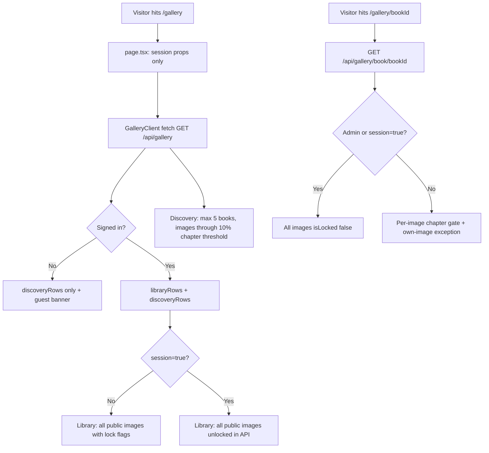

# Gallery system

This document describes how the **Public Gallery** (`/gallery`) and **per-book gallery** (`/gallery/[bookId]`) work: routing, data loading, which images appear for each viewer, and how chapter spoiler gating is applied on the server and client.

---

## Routes and file map

| URL | Server entry | Client UI | Data source |
|-----|--------------|-----------|-------------|
| `/gallery` | `app/(public)/gallery/page.tsx` | `gallery-client.tsx` | Client fetch → `GET /api/gallery` |
| `/gallery/[bookId]` | `app/(public)/gallery/[bookId]/page.tsx` | `gallery-book-client.tsx` | Client fetch → `GET /api/gallery/book/[bookId]` |

Shared styling: `app/(public)/gallery/gallery-redesign.css` (scoped under `.gallery-root` on the main gallery page).

Supporting libraries:

| File | Role |
|------|------|
| `lib/gallery-types.ts` | Shared `GalleryImageCard`, `BookGalleryRow`, API response types |
| `lib/gallery-page-data.ts` | Library/discovery row builders, viewer context, discovery like helper |
| `lib/gallery-spoiler.ts` | Chapter gate mode resolution and lock predicates |
| `lib/gallery-image-lock-server.ts` | Server-side lock check (likes API, mirrors gallery rules) |
| `lib/gallery-card-spoiler-badge.ts` | Corner padlock badge colours on thumbnails |
| `lib/gallery-comment-counts.ts` | Visible comment counts on cards (matches comment visibility rules) |
| `lib/featured-image-selection.ts` | Featured image selection (used elsewhere; not on main `/gallery`) |
| `components/gallery/gallery-book-row.tsx` | Book-grouped horizontal row (anchor + image strip) |
| `components/gallery/gallery-genre-pills.tsx` | Client-side genre filter pills |
| `components/gallery/gallery-image-modal-shell.tsx` | Modal portal, scroll lock, positioning below nav |
| `components/gallery/gallery-spoiler-select.tsx` | “Hiding spoilers” / “Showing spoilers” dropdown |
| `components/gallery/modal-image-swipe-view.tsx` | Modal image pane, blur + lock overlay, swipe transitions |
| `hooks/use-horizontal-drag-scroll.ts` | Pointer-capture drag scroll for horizontal strips |

API routes:

| Route | Purpose |
|-------|---------|
| `GET /api/gallery` | Library + discovery book rows for main gallery |
| `GET /api/gallery?session=true` | Same, but library rows include chapter-locked images unlocked (session browsing override) |
| `GET /api/gallery/book/[bookId]` | All public images for one book (+ lock flags) |
| `GET /api/gallery/book/[bookId]?session=true` | Same, but authenticated users get `isLocked: false` (session browsing override) |
| `GET /api/gallery/book/[bookId]?featured=true` | Featured subset for a book (used elsewhere) |
| `POST /api/gallery/[imageId]/like` | Like an image (re-checks chapter lock; accepts session unlock book IDs; discovery preview exception) |

---

## Data model constraints

Every gallery image is a `GeneratedImage` row that must satisfy:

- **`isPublic: true`** — only public images appear in either gallery.
- **`book.status: "published"`** and **`book.deletedAt: null`** — book must be live.

Additional flags on cards:

- **`isFeatured`** — admin-curated; gold star badge when unlocked (still on cards; main gallery no longer has a separate featured section).
- **`chapterNumberAtTime`** — chapter the image was generated at; used for spoiler gating.
- **`likeCount`**, **`userId`**, **`userPrompt`**, book/user metadata — display and interaction.

---

## Main Public Gallery (`/gallery`)

### Architecture

The server page is **session-only**: it resolves the viewer via `getCurrentUser()` (supports dev role switcher / dev guest), loads account spoiler settings and active library book IDs, and passes those props to `GalleryClient`.

**All gallery image data** is loaded client-side:

```ts
fetch(`/api/gallery${sessionReveal ? "?session=true" : ""}`)
```

Response shape (`GalleryPageApiResponse`):

```ts
{
  libraryRows: BookGalleryRow[]
  discoveryRows: BookGalleryRow[]
  userGenrePreferences: string[]
  libraryMeta: {
    hasLibraryBooks: boolean
    hasVisibleLibraryImages: boolean
  }
}
```

Each `BookGalleryRow` contains book metadata plus `images: GalleryImageCard[]` (full modal-capable shape).

### Layout

```
Header (eyebrow, title, subtitle, BadgeLegend + GallerySpoilerSelect for members)
Guest banner (guests only)
Genre pills (client filter on row.genre; "All" default)
FROM YOUR LIBRARY — BookRow[] (one row per library book with visible images)
DISCOVER — BookRow[] + invitation card last in each discovery strip
Empty states (no_books / no_images / global empty)
```

**Removed from main gallery:** masonry grids, LATEST FEATURED carousel, and guest library blur teaser. Guests see **discovery rows only** plus a sign-in banner.

### Library rows (`buildLibraryRows`)

- Books in the viewer’s **active library** (`UserBook.isActive: true`) on published books.
- All **public** images per book are returned with `isLocked` / `lockKind` flags (client blurs locked cards).
- **Unstarted preview:** when there is no `ReadingProgress`, images at or below `ceil(chapterCount * 0.10)` are unlocked; later chapters are locked (`lockKind: "unstarted"`).
- **Started reading:** images with `chapterNumberAtTime <= currentChapter` are unlocked; later chapters are locked (`lockKind: "chapter"`).
- Own images are never locked.
- Session reveal (`?session=true`) or admin: all library images returned with `isLocked: false`.
- Row order: `ReadingProgress.updatedAt desc`, then `UserBook.addedAt desc`.
- Books with zero public images are omitted.

### Discovery rows (`buildDiscoveryRows`)

- Published books **not** in the viewer’s active library.
- Per book: `threshold = ceil(chapterCount * 0.10)`.
- Only images with `chapterNumberAtTime <= threshold` are included.
- `totalPublicImages` is the full public count for the book (used for invitation card copy).
- Sort: genre preference overlap first, then qualifying image count desc.
- Cap: **5 rows**.
- Last card in strip: **invitation card** — “X more images inside” where `X = totalPublicImages - images.length`.
  - Logged in: `POST /api/library/{bookId}` with `{ spoilerProtection: "PROTECTED" }`, then refetch gallery.
  - Guest: link to `/login`.

### Genre filtering

Client-side only — no refetch. Pills are built from genres present in loaded rows plus `userGenrePreferences` from the API. Labels use `formatGenre` / `GENRE_LABELS`.

### Header controls

- **Members:** badge legend + `GallerySpoilerSelect`.
- **Guests:** no spoiler dropdown (no library rows to affect).

### Session reveal (main gallery)

When a member selects **“Showing spoilers”**, the client **refetches** `GET /api/gallery?session=true`. The API returns all library images with `isLocked: false` (same trust model as per-book gallery). Toggling back refetches without the param.

Likes while session reveal is active send:

```json
{ "sessionBrowsingUnlockedBookIds": ["<bookId>"] }
```

Comments use `sessionCommentsUnlocked` for the same books.

**Admins** never see locked images; session refetch is not required for display.

### Client-side state (`gallery-client.tsx`)

- `imagesById` — merged from API rows; optimistic like updates via `mergeGalleryServerImages`.
- `isImageLocked(image)` — admin → false; otherwise server `image.isLocked` from latest fetch.
- `canLikeImage(image)` — logged in, not own image, not already liked, not locked.
- Modal carousel spans **all unlocked images** across library + discovery rows.

### Modal behaviour (main gallery)

- Opens from any card; rendered through **`GalleryImageModalShell`** (portaled to `document.body`, body scroll locked, positioned below fixed nav).
- **Locked modal**: blurred image, no prompt disclosure, no comments sidebar; unlock / add-to-library CTAs.
- **Unlocked modal**: prompt disclosure, comments sidebar, like/share/admin featured toggle, link to per-book gallery.

---

## Per-book gallery (`/gallery/[bookId]`)

Unchanged by the main gallery redesign.

### Server page

Loads book metadata and session context, then passes props to `GalleryBookClient`. **Images are not loaded on the server.**

### Client fetch

```ts
fetch(`/api/gallery/book/${bookId}${sessionReveal ? "?session=true" : ""}`)
```

- **`sessionReveal`** — toggled by `GallerySpoilerSelect` when the book is in the user’s library.
- When `sessionReveal` becomes `true`, refetch with `?session=true`.
- Legacy `sessionStorage` key `novelviz_session_unlocks` is **cleared on mount**.

### Display lock (`displayLocked`)

```ts
if (isAdmin) return false;
if (sessionReveal) return false;
if (viewerUserId === image.userId) return false;
return image.isLocked;
```

---

## Discovery preview likes

For books **not** in the viewer’s active library, likes are allowed on images at or below the discovery threshold (`ceil(totalChapters * 0.10)`) even without library membership or reading progress.

Implemented in `lib/gallery-image-lock-server.ts` via `isDiscoveryPreviewLikeAllowed` (must match discovery row builder threshold math exactly).

---

## Spoiler gating

### Settings hierarchy

| Setting | Location | Values |
|---------|----------|--------|
| Account default | `User.globalSpoilerProtection` | boolean (default `true`) |
| Per-book override | `UserBook.spoilerProtection` | `INHERIT` \| `PROTECTED` \| `UNLOCKED` |
| Reading progress | `ReadingProgress.currentChapterNumber` | number or missing |

**Effective chapter gate mode** (`effectiveChapterGateMode` in `lib/gallery-spoiler.ts`):

| `UserBook.spoilerProtection` | Result |
|------------------------------|--------|
| `UNLOCKED` | `show_all` — never chapter-gate this book |
| `PROTECTED` | `gate_chapters` — always chapter-gate |
| `INHERIT` | `gate_chapters` if `globalSpoilerProtection === true`, else `show_all` |

### When an image is locked

Given `gate_chapters` mode, a **community** image is locked when the viewer is **not** the image creator and:

1. **No reading progress:** image is above the 10% discovery threshold (`chapterNumberAtTime > ceil(totalChapters * 0.10)`).
2. **Reading progress saved:** `currentChapter < image.chapterNumberAtTime`.

When there is no reading progress, images at or below the 10% threshold are **unlocked** (library early preview).

**Exceptions:** admin viewers; own images; discovery preview likes (like API only); session reveal / `?session=true` API override; `UNLOCKED` per-book or global protection off (`show_all` mode).

### Lock kinds

| `lockKind` | Meaning |
|------------|---------|
| `none` | Visible |
| `chapter` | Reader has started but hasn’t reached this chapter |
| `unstarted` | No reading progress; image is beyond the 10% early-preview threshold |

(`guest_blur` was used by the old guest library teaser; removed from main gallery.)

### Padlock badge colours (`resolveLibraryPadlockBadge`)

On **library** row cards (and per-book gallery when not in session reveal), when image is unlocked:

| Variant | Meaning |
|---------|---------|
| Aqua | Viewer’s own image |
| Green | Chapter gate active; image within reading progress |
| Yellow | Spoiler protection effectively off |
| Red | Book set to `UNLOCKED` while account still has global protection on |

Featured images show a **gold star** when `isFeatured` and unlocked.

### Permanent unlock

- `PATCH /api/user-books/{bookId}/spoiler-protection` with `{ setting: "UNLOCKED" }`
- If user doesn’t have the book: `POST /api/library/{bookId}` with `{ spoilerProtection: "UNLOCKED" }`

---

## How the system decides what each user sees



| Viewer | Main gallery — library section | Main gallery — discover section | Book gallery |
|--------|----------------------------------|----------------------------------|--------------|
| Guest | Empty (no library) | Up to 5 preview rows; invitation → login | All images from API |
| Member, no library books | Empty state CTA | Discovery rows + invitation | Locks unless admin / session / own image |
| Member, with library | One row per library book with public images; locked cards blurred | Discovery for non-library books | Same as before |
| Admin | All library images, never locked | Discovery previews, never locked | Never locked |

---

## Comment counts on cards

`viewerVisibleCommentCountByImageIds` aggregates comments the same way as the comments API for that viewer — including spoiler-flagged comments gated by chapter.

---

## Related systems (out of scope but linked)

- **Dashboard admin queues** use `SpoilerReviewGalleryModal`.
- **Comment visibility** — see `docs/commenting-system.md`.
- **Featured scoring** — `lib/featured-image-selection.ts`; still used outside main `/gallery`.

---

## Quick reference: key client state variables

| Variable | File | Resets when |
|----------|------|-------------|
| `sessionReveal` (main gallery API refetch) | `gallery-client.tsx` | Gallery page mount |
| `sessionReveal` | `gallery-book-client.tsx` | `bookId` change |
| `spoilerSettingsByBookId` | `gallery-client.tsx` | Synced from server props; updated after unlock |
| `imagesById` | `gallery-client.tsx` | Merged from API; optimistic like updates |
| `selectedGenre` | `gallery-client.tsx` | Client filter only |

---

## Stacking / modal implementation note

The main gallery root uses `isolation: isolate` in CSS. Image modals **must** portal to `document.body` (`GalleryImageModalShell`) so they render above the fixed nav and are not clipped by the gallery stacking context.
