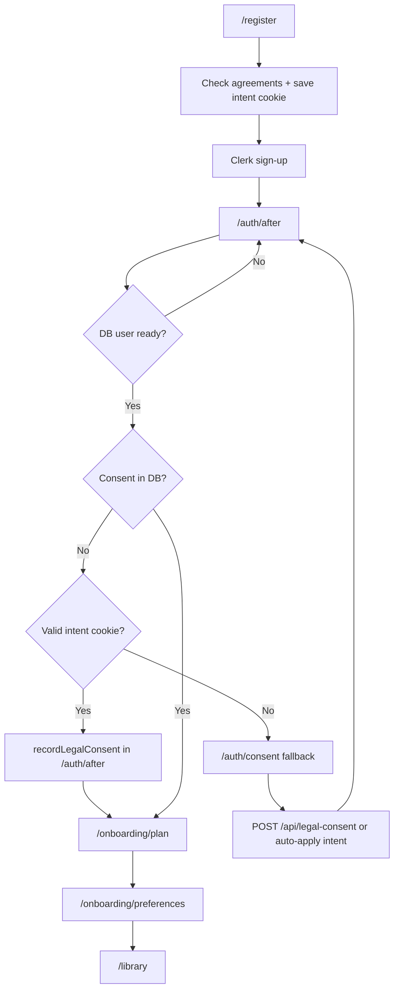

# Legal consent at sign-up

This document describes how NovelViz collects **mandatory legal agreements** at registration, what we store in the database as an audit trail, and why this is implemented in the app rather than solely through Clerk.

For the broader sign-up and onboarding sequence, see [sign-up-onboarding.md](./sign-up-onboarding.md). For Clerk URLs, webhooks, and session handling, see [auth-workflow.md](./auth-workflow.md).

---

## Policy

NovelViz is intended for **readers aged 18 and over**. We do not have a robust policy for users under 18, and the product must not encourage or appear to support under-18 usage in any facet (profile pickers, partner targeting, analytics, and so on).

At sign-up, every new account must explicitly confirm:

1. **I am 18 years of age or older**
2. **I agree to the [Terms of Service](/terms)**
3. **I agree to the [Privacy Policy](/privacy)**

All three are **mandatory**. We record **when** each attestation was accepted, along with the **document version** in effect at that time, so there is a concrete record on our side.

---

## Can this be done on the Clerk sign-up screen?

**Partially — but not in the way we need.**

| Requirement | Clerk prebuilt `<SignUp />` | NovelViz approach |
|---|---|---|
| Combined Terms + Privacy checkbox | Yes — enable **Legal compliance** in the Clerk Dashboard (one checkbox, links to your legal URLs) | Handled in-app (separate checkboxes + DB record) |
| Separate Terms checkbox | No | In-app |
| Separate Privacy checkbox | No | In-app |
| “I am 18+” checkbox | No | In-app |
| Timestamped audit trail in **our** database | No — Clerk stores acceptance in Clerk | `User` fields in Neon via `POST /api/legal-consent` |

Clerk’s legal compliance feature is useful for a single combined “I agree to Terms & Privacy” control, but it does **not** support three separate mandatory attestations, does **not** cover the 18+ confirmation, and does **not** write proof into the NovelViz database.

For a custom Clerk sign-up UI (`useSignUp()`), you could pass a `legalAccepted` boolean — still one combined flag, still stored in Clerk unless you sync it yourself.

**Recommendation:** Do **not** enable Clerk’s separate **Require express consent to legal documents** setting. It would duplicate terms/privacy UX and still would not satisfy our 18+ or database audit requirements. Handle all three agreements through the NovelViz flow described below.

---

## What we built

### 1. Register page (`/register`)

The user completes a **custom email/password form** (Clerk `useSignUp()` in the background — no embedded Clerk widget):

- Email and password fields (always editable)
- Consent checkboxes below the password (18+ and combined Terms + Privacy)
- **Create account** disabled until all fields are valid and both consents are checked

After email verification, the client calls **`POST /api/legal-consent`** while authenticated and redirects to **`/onboarding/plan`**. The intent cookie is **not** used on this happy path.

**Implementation:** [`components/auth/custom-email-sign-up.tsx`](../components/auth/custom-email-sign-up.tsx), [`components/auth/sign-up-legal-consent.tsx`](../components/auth/sign-up-legal-consent.tsx)

### 2. Authoritative DB write

**Email sign-up:** `POST /api/legal-consent` immediately after verification (before onboarding).

**Sign-in / fallback:** **`/auth/after`** may apply the intent cookie via `tryApplyLegalConsentIntent()`, or send the user to **`/auth/consent`** if consent is still missing.

**Implementation:** [`app/auth/after/page.tsx`](../app/auth/after/page.tsx), [`lib/legal-consent.ts`](../lib/legal-consent.ts) (`recordLegalConsent`, `tryApplyLegalConsentIntent`)

### 3. Fallback consent page (`/auth/consent`)

If the intent cookie is missing, expired, or invalid (e.g. OAuth edge case, login before this feature, intent save failed), the user is sent to **`/auth/consent`** to submit the agreements manually. This page auto-applies a valid intent cookie if present; otherwise it renders the checkbox form.

**Implementation:** [`app/auth/consent/page.tsx`](../app/auth/consent/page.tsx), [`app/auth/consent/consent-client.tsx`](../app/auth/consent/consent-client.tsx)

### 4. API

**`POST /api/legal-consent-intent`** (public, pre-auth)

- Called from `/register` when agreements are checked.
- Validates all three booleans and document versions; sets the bridge cookie.

**`POST /api/legal-consent`**

- Requires an authenticated session.
- Body must include all three booleans set to `true`:
  - `over18Confirmed`
  - `termsAccepted`
  - `privacyAccepted`
- Rejects the request if any are missing or false.
- Writes a single server `DateTime` for all three acceptance fields (the moment of submission).

**Implementation:** [`app/api/legal-consent/route.ts`](../app/api/legal-consent/route.ts), [`app/api/legal-consent-intent/route.ts`](../app/api/legal-consent-intent/route.ts), helpers in [`lib/legal-consent.ts`](../lib/legal-consent.ts)

### 5. Access gating

Users cannot proceed to onboarding or the reader app until consent is recorded:

- [`app/auth/after/page.tsx`](../app/auth/after/page.tsx) applies the intent cookie, then redirects to `/auth/consent` only if consent is still missing.
- [`app/(reader)/onboarding/layout.tsx`](../app/(reader)/onboarding/layout.tsx) redirects to `/auth/consent` if someone navigates to onboarding directly.
- [`app/(reader)/(app)/layout.tsx`](../app/(reader)/(app)/layout.tsx) redirects to `/auth/consent` before allowing library, account, dashboard, etc.

Routing helper: `resolvePostAuthRedirect()` and `getLegalConsentRedirectIfNeeded()` in [`lib/session-profile.ts`](../lib/session-profile.ts) and [`lib/legal-consent.ts`](../lib/legal-consent.ts).

---

## Database fields

Added to the `User` model (migration `20260624120000_user_legal_consent`):

| Field | Type | Purpose |
|---|---|---|
| `over18ConfirmedAt` | `DateTime?` | When the user confirmed they are 18+ |
| `termsAcceptedAt` | `DateTime?` | When the user accepted the Terms of Service |
| `privacyAcceptedAt` | `DateTime?` | When the user accepted the Privacy Policy |
| `termsDocumentVersion` | `String?` | Version of Terms in effect at acceptance |
| `privacyDocumentVersion` | `String?` | Version of Privacy Policy in effect at acceptance |

A user is considered to have completed legal consent when **all three** `*At` fields are non-null (`userHasRequiredLegalConsent()` in [`lib/legal-consent.ts`](../lib/legal-consent.ts)).

### Document versions

Constants in [`lib/legal-consent.ts`](../lib/legal-consent.ts):

- `TERMS_DOCUMENT_VERSION` — must stay in sync with `LAST_UPDATED` on [`app/(public)/terms/page.tsx`](../app/(public)/terms/page.tsx)
- `PRIVACY_DOCUMENT_VERSION` — must stay in sync with `LAST_UPDATED` on [`app/(public)/privacy/page.tsx`](../app/(public)/privacy/page.tsx)

Current value for both: **`2026-05-01`**.

When you publish new Terms or Privacy Policy text, bump the corresponding constant so future acceptances record which version the user agreed to.

---

## User flow (new account)

1. **`/register`** — user checks agreements; intent cookie is saved; Clerk sign-up unlocks; account is created in Clerk.
2. **`/auth/after`** — provisioning wait until NovelViz `User` row exists; apply intent cookie and write consent to DB.
3. **`/auth/consent`** — fallback only when intent bridge failed; manual submit or server-side auto-apply.
4. **Onboarding** — plan → preferences → library (unchanged; see [sign-up-onboarding.md](./sign-up-onboarding.md)).

### Returning users (sign-in)

After **`/login`**, the same **`/auth/after`** routing applies. If an existing account has no consent on file (e.g. created before this feature), they are sent to **`/auth/consent`** before onboarding or the reader app.

---

## Age range (related policy)

Separate from legal consent, **selectable age ranges** are 18+ only:

- Onboarding and account profile pickers use [`USER_AGE_RANGE_OPTIONS`](../lib/age-range.ts) (bands from 18–24 through 55+, plus “Prefer not to say”).
- **Under 18** is not offered anywhere in the UI.
- Partner targeting and analytics use the same 18+ bands; legacy `UNDER_18` enum values in old rows are not surfaced or accepted on new writes.

See [`lib/age-range.ts`](../lib/age-range.ts) for the single source of truth.

---

## Development

Dev seed users receive backfilled consent timestamps via `devLegalConsentUpdate()` in [`prisma/seed.ts`](../prisma/seed.ts) so local role switching is not blocked by `/auth/consent`.

---

## Clerk Dashboard checklist

- **Do not** enable “Require express consent to legal documents” (avoids duplicate Terms/Privacy UI).
- Ensure sign-up and sign-in redirect URLs remain **`/auth/after`** (see [auth-workflow.md](./auth-workflow.md)).
- Terms and Privacy URLs for marketing/footer purposes: **`/terms`**, **`/privacy`**.

---

## Possible follow-ups

Not implemented today; consider if legal counsel asks for a stronger audit trail:

- Store **IP address** and **User-Agent** at consent submission time.
- One-time **backfill campaign** for existing production users (email + forced `/auth/consent` on login).
- Separate timestamps if Terms and Privacy are ever accepted on different screens (today all three share one submission moment).

---

## Key files

| Area | Path |
|---|---|
| Consent helpers & document versions | [`lib/legal-consent.ts`](../lib/legal-consent.ts) |
| Intent cookie API | [`app/api/legal-consent-intent/route.ts`](../app/api/legal-consent-intent/route.ts) |
| Consent API | [`app/api/legal-consent/route.ts`](../app/api/legal-consent/route.ts) |
| Checkbox UI (shared) | [`components/auth/sign-up-legal-consent.tsx`](../components/auth/sign-up-legal-consent.tsx) |
| Register form (custom Clerk flow) | [`components/auth/custom-email-sign-up.tsx`](../components/auth/custom-email-sign-up.tsx) |
| Session provisioning poll | [`app/api/auth/session-ready/route.ts`](../app/api/auth/session-ready/route.ts) |
| Post-auth consent page | [`app/auth/consent/`](../app/auth/consent/) |
| Post-Clerk routing | [`app/auth/after/page.tsx`](../app/auth/after/page.tsx) |
| Prisma migration | [`prisma/migrations/20260624120000_user_legal_consent/`](../prisma/migrations/20260624120000_user_legal_consent/) |
| Age range options (18+ only) | [`lib/age-range.ts`](../lib/age-range.ts) |
