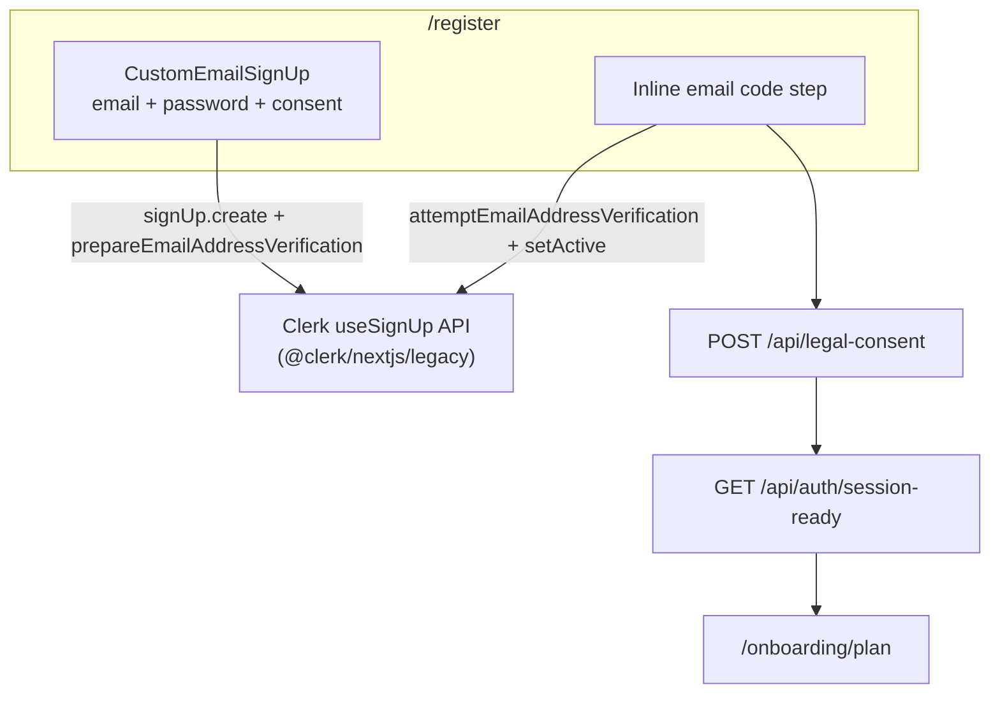
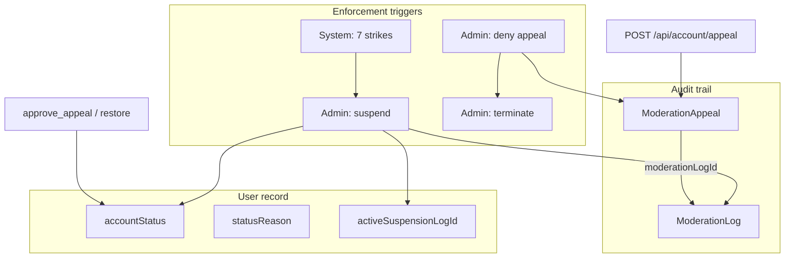

# NovelViz platform reference: sign-up & account enforcement

**Purpose:** Source document for developer guides, marketing copy, and user-facing help.  
**Last updated:** June 2026 (reflects custom email sign-up redesign and suspension/appeal system).

---

## Table of contents

1. [Executive summary](#1-executive-summary)
2. [Sign-up & onboarding](#2-sign-up--onboarding)
   - [User experience (plain language)](#21-user-experience-plain-language)
   - [Creative & UX decisions](#22-creative--ux-decisions)
   - [Technical architecture](#23-technical-architecture)
   - [Legal consent](#24-legal-consent)
   - [Returning users (sign-in)](#25-returning-users-sign-in)
3. [Account suspension & appeals](#3-account-suspension--appeals)
   - [Concepts & terminology](#31-concepts--terminology)
   - [User experience](#32-user-experience)
   - [Admin experience](#33-admin-experience)
   - [Technical architecture](#34-technical-architecture)
   - [Access control matrix](#35-access-control-matrix)
4. [Data model summary](#4-data-model-summary)
5. [Key files index](#5-key-files-index)
6. [Audience-specific extracts](#6-audience-specific-extracts)

---

## 1. Executive summary

**Sign-up** is a single, NovelViz-branded email/password flow. Users never see Clerk’s embedded sign-up widget. After email verification, legal agreements are saved to our database and the user goes directly to plan selection.

**Sign-in** still uses Clerk’s sign-in widget at `/login` and routes through `/auth/after` for database provisioning and onboarding checks.

**Account enforcement** uses three account states (`active`, `suspended`, `terminated`). Strikes are recorded in a moderation log. Suspensions can be appealed once per cycle; admins review appeals in the user detail panel. Suspended users are blocked from the app (gallery, library, comments, etc.) but can still reach the landing page, their suspension status page, and auth routes.

---

## 2. Sign-up & onboarding

### 2.1 User experience (plain language)

| Step | What the user sees | What happens behind the scenes |
|------|-------------------|-------------------------------|
| 1 | Opens **Create account** at `/register` | Server checks if already signed in → sends to library/onboarding if so |
| 2 | Fills **email**, **password**, and two agreement checkboxes | All fields are editable immediately |
| 3 | Taps **Create account** (disabled until everything is valid) | Clerk creates the account; verification email is sent |
| 4 | Enters **verification code** on the same page | Clerk confirms email; session is activated |
| 5 | Brief wait, then **Choose your plan** at `/onboarding/plan` | Legal consent saved to DB; NovelViz user row provisioned |
| 6 | Picks Free/Standard (or Partner interest) | Plan step cookie set |
| 7 | **Setup your profile** — username, genres, optional demographics | Profile saved |
| 8 | **Library** — normal reading experience | Onboarding complete when username + ≥1 genre exist |

**Completion rule:** onboarding is finished when the user has a **username** and **at least one genre preference**.

**Age policy:** NovelViz is for readers **18 and over**. Sign-up requires an explicit 18+ confirmation plus agreement to Terms and Privacy.

### 2.2 Creative & UX decisions

#### Problem we solved

The previous design placed legal checkboxes **above** a locked Clerk widget. Users had to agree before they could even see email/password fields. Many users also hit a **second** agreement page (`/auth/consent`) and a stuck **`/auth/after`** screen after verification.

#### Design principles (current)

1. **Conventional form order** — email → password → agreements → submit. Matches familiar patterns (SaaS, social platforms, app stores).
2. **Progressive disclosure** — verification code appears on the same page after account creation, not a separate Clerk-branded step.
3. **Single consent moment** — on the happy path, users check agreements once at register; they are not asked again.
4. **NovelViz visual identity** — Cormorant Garamond headline, gradient title shimmer, card panel, integrated consent options. No Clerk chrome on register.
5. **Clear affordances** — submit button stays disabled until email, password (≥8 chars), and both consents are valid.
6. **Email-only for now** — social/OAuth sign-up removed from register to simplify the first-run experience.

#### Copy tone (register)

- Eyebrow: “NovelViz”
- Headline: “Create account”
- Lede: “A spoiler-safe AI reading companion for readers aged 18 and over.”
- Verification: “We sent a verification code to **{email}**.”
- CTA: “Create account” → “Verify and continue”

### 2.3 Technical architecture



#### Clerk integration

- **Provider:** Clerk handles authentication (password hashing, email delivery, sessions, JWT).
- **UI:** Custom form via `useSignUp()` from `@clerk/nextjs/legacy` — headless API, not the `<SignUp />` component.
- **No special Clerk dashboard mode** — standard email + password + email verification must be enabled.

#### Database user provisioning

| Path | When |
|------|------|
| **Webhook** (primary) | `user.created` → `POST /api/webhooks/clerk` creates `User` row |
| **Fallback** | `ensureCurrentUser()` upserts from Clerk profile on first authenticated request |

After verification, `GET /api/auth/session-ready` polls until the DB user exists and returns the correct redirect (typically `/onboarding/plan` for new users).

#### Routes

| URL | Role |
|-----|------|
| `/register` | New account (custom form) |
| `/sign-up` | Legacy redirect → `/register` |
| `/login` | Returning users (Clerk `<SignIn />`) |
| `/auth/after` | Post–sign-in provisioning & routing (not used on register happy path) |
| `/auth/consent` | Fallback consent page (legacy accounts, failed consent write) |
| `/onboarding/plan` | Plan selection |
| `/onboarding/preferences` | Username & genres |
| `/library` | Reader home when onboarding complete |

### 2.4 Legal consent

Three mandatory attestations, stored in **our** database with timestamps and document versions:

| Field | Meaning |
|-------|---------|
| `over18ConfirmedAt` | User confirmed 18+ |
| `termsAcceptedAt` | Terms of Service accepted |
| `privacyAcceptedAt` | Privacy Policy accepted |
| `termsDocumentVersion` | Version of Terms in effect (currently `2026-06-25`) |
| `privacyDocumentVersion` | Version of Privacy in effect (currently `2026-06-25`) |

**Register happy path:** after email verification, `POST /api/legal-consent` writes all three timestamps server-side.

**Fallback paths:**

- **Intent cookie** (`legal_consent_intent`, 15 min) — used when sign-in lands on `/auth/after` without DB consent (e.g. older accounts).
- **`/auth/consent`** — manual checkbox form if cookie bridge fails.

Clerk’s built-in “legal compliance” checkbox is **not** used; it cannot satisfy 18+ or our audit trail requirements.

### 2.5 Returning users (sign-in)

1. `/login` → Clerk sign-in widget  
2. `/auth/after` → provision DB user if needed, apply consent fallback, route via `resolvePostAuthRedirect()`  
3. Destination: `/library` if onboarding complete, else `/onboarding/plan` or `/onboarding/preferences`

Provisioning uses fetch-based polling of `/api/auth/session-ready` (no full-page reload loop).

---

## 3. Account suspension & appeals

### 3.1 Concepts & terminology

| Term | Meaning |
|------|---------|
| **Strike** | An entry in `ModerationLog` — any moderation incident (admin action, user flag, system auto-suspend, etc.) |
| **Strike count** | Total moderation log rows for the user (not a separate counter) |
| **Suspension** | `accountStatus = suspended` — user cannot use app features; may submit one appeal per suspension cycle |
| **Termination** | `accountStatus = terminated` — permanent; credits forfeited; no appeal |
| **Appeal** | User-written explanation linked to the **specific suspension log** that caused the current suspension |
| **Suspension cycle** | Strikes leading up to a suspension → suspension action → optional appeal → restore or deny |

**Auto-suspend threshold:** 7 strikes triggers automatic suspension (system log + suspend). Hook exists for future content-moderation integration.

### 3.2 User experience

#### When suspended

- Redirected to **`/account/suspended`** when trying to use the app.
- Can still visit: landing page (`/`), `/account/suspended`, login/register, appeal API.
- **Cannot:** gallery, library, reader, comments, likes, onboarding, partner/admin areas.

#### Suspension page (`/account/suspended`)

- Headline: “Your account is suspended”
- Shows admin **reason** (`statusReason`) if set
- **Strike history** list
- **Submit an explanation** — free-text appeal (one pending appeal at a time)
- After submit: confirmation that admin will review
- Link to Acceptable Use Policy

#### Appeals — user rules

- Only while **suspended** (not terminated)
- **One pending appeal** at a time
- Appeal is **permanently linked** to the moderation log for the current suspension (`activeSuspensionLogId` → `ModerationAppeal.moderationLogId`)
- Admin receives email notification with appeal text, strike history, and link to admin user page

#### When terminated

- Redirected to **`/account/terminated`**
- No appeal path
- Credits forfeited via ledger
- Cannot self-delete account

#### After restore

- `accountStatus` → `active`
- Suspension timestamps and reason cleared
- Pending appeal marked **approved**
- User can use the app normally; strike history remains for audit

#### After appeal denied

- Appeal marked **denied**
- Account **terminated**
- Credits forfeited

### 3.3 Admin experience

#### User list (`/admin/users`)

- **Status** column shows `accountStatus` (`active`, `suspended`, `terminated`) — not subscription status.

#### User detail — Account enforcement panel

Consolidated single section containing:

| Area | Content |
|------|---------|
| Summary | Account status, strike count, suspended/terminated timestamps, status reason, pending appeal badge |
| Strike history | **Grouped by suspension cycle** (newest first) |
| Per cycle | Amber card = suspension; red card = termination; numbered “Suspension #N”; strikes leading up; suspension action; nested user explanation |
| Open strikes | Dashed section if strikes accumulated since last suspension |
| Actions | Suspend, Terminate, Restore active, Approve & restore, Deny appeal |
| Notes | Optional reason/resolution note field |

#### Admin action logic

| Button | When shown | Effect |
|--------|------------|--------|
| **Suspend** | Status not suspended/terminated | Creates moderation log, sets suspended, stores `activeSuspensionLogId` |
| **Terminate** | Not terminated | Terminates, forfeits credits, clears active suspension pointer |
| **Restore active** | Suspended, **no** pending appeal | Restores to active |
| **Approve & restore** | Pending appeal | Restores + approves appeal |
| **Deny appeal** | Pending appeal | Denies appeal + terminates account |

**Design note:** “Restore active” is hidden while an appeal is pending — admin must explicitly approve or deny the appeal.

### 3.4 Technical architecture



#### Enforcement libraries

| Module | Responsibility |
|--------|----------------|
| `lib/account-enforcement.ts` | suspend, terminate, restore, appeal submit, strike threshold, moderation logs |
| `lib/account-status-routing.ts` | Page guards, API guards, redirect paths |
| `lib/moderation-appeal-matching.ts` | Group appeals under strikes; build suspension episodes for admin UI |
| `proxy.ts` | Sets `x-pathname` / `x-url` headers for route guards |

#### API guards

Suspended/terminated users receive **403** on:

- Comment create/edit/delete/flag
- Gallery like actions
- Other routes using `accountEnforcementApiGuard` / `accountEnforcementApiGuardForRequest`

Allowed API: `POST /api/account/appeal`, webhooks.

#### Page guards

| Layout group | Guard type |
|--------------|------------|
| `(public)`, `(reader)`, `(partner)`, `admin`, onboarding | **Restricted** — always redirect enforced users |
| `(marketing)`, `account`, `auth` | **Allowlist** — landing, status pages, login/register |

Fail-closed: if pathname cannot be determined, enforced users are redirected (prevents gallery bypass bug).

### 3.5 Access control matrix

| Resource | Active | Suspended | Terminated |
|----------|--------|-----------|------------|
| Landing `/` | Yes | Yes | Yes |
| `/register`, `/login` | Yes | Yes | Yes |
| `/account/suspended` | Redirect to library | Yes | Redirect to terminated |
| `/account/terminated` | Redirect | Redirect | Yes |
| Gallery, discover, library, reader | Yes | **No** | **No** |
| Comments, likes | Yes | **No** | **No** |
| Submit appeal | No | **Yes** (once pending) | No |
| Onboarding | Yes | **No** | **No** |
| Admin panel | Admin role | **No** | **No** |
| Self-delete account | Yes | **No** | **No** |

---

## 4. Data model summary

### User (enforcement fields)

```
accountStatus          active | suspended | terminated
suspendedAt            DateTime?
terminatedAt           DateTime?
statusReason           String?
activeSuspensionLogId  String? (FK → ModerationLog, current suspension anchor)
```

### ModerationLog (strike)

```
source       admin | auto | user_flag | system
aupCategory  optional category label
summary      human-readable description
commentId / queryId / imageId  optional links to content
createdBy    admin user id
flaggedByUserId  reporter
createdAt
```

### ModerationAppeal

```
status           pending | approved | denied
userMessage      user's explanation text
moderationLogId  FK to the suspension strike this appeal responds to
resolvedAt / resolvedBy / resolutionNote
```

---

## 5. Key files index

### Sign-up & auth

| File | Purpose |
|------|---------|
| `components/auth/custom-email-sign-up.tsx` | Register form + verification |
| `components/auth/sign-up-legal-consent.tsx` | Shared consent checkbox UI |
| `app/register/[[...rest]]/page.tsx` | Register route |
| `app/login/[[...rest]]/page.tsx` | Sign-in route |
| `app/auth/after/page.tsx` | Post–sign-in routing |
| `app/auth/after/auth-after-provisioning.tsx` | Provisioning loader |
| `app/api/auth/session-ready/route.ts` | Provisioning poll endpoint |
| `app/api/legal-consent/route.ts` | Authoritative consent write |
| `lib/legal-consent.ts` | Consent helpers & intent cookie |
| `lib/session-profile.ts` | Onboarding stage & post-auth redirects |
| `lib/auth.ts` | `ensureCurrentUser`, Clerk ↔ DB bridge |
| `app/api/webhooks/clerk/route.ts` | Clerk webhook handler |

### Enforcement

| File | Purpose |
|------|---------|
| `lib/account-enforcement.ts` | Core enforcement logic |
| `lib/account-status-routing.ts` | Route & API guards |
| `app/account/suspended/page.tsx` | User suspension page |
| `app/account/terminated/page.tsx` | User termination page |
| `app/api/account/appeal/route.ts` | User appeal submission |
| `app/api/admin/users/[userId]/enforcement/route.ts` | Admin enforcement actions |
| `app/admin/users/[userId]/user-detail-client.tsx` | Admin enforcement UI |
| `components/admin/enforcement-strike-history.tsx` | Grouped strike history UI |
| `lib/moderation-appeal-matching.ts` | Appeal ↔ strike linking & episode grouping |
| `proxy.ts` | Middleware + pathname headers |

### Related docs

| Doc | Focus |
|-----|-------|
| `docs/sign-up-onboarding.md` | Step-by-step onboarding |
| `docs/legal-consent-signup.md` | Consent architecture |
| `docs/auth-workflow.md` | Clerk URLs & webhooks |

---

## 6. Audience-specific extracts

### For marketing & product

**Sign-up value props to emphasize:**

- One smooth form — email, password, agree, verify, pick a plan
- Built for readers 18+ who want spoiler-safe AI reading
- No surprise second agreement page on normal sign-up
- Free and Standard plans during beta

**Enforcement messaging (external):**

- We maintain a fair-use policy with a strike system
- Suspension is reviewable — users can submit an explanation
- Termination is reserved for serious or repeated violations
- Suspended users retain access to their account status page and can appeal

**Do not promise:**

- Instant appeal approval
- Social sign-up on register (not currently offered)
- Under-18 use

### For support & user help

**“I can’t sign up”**

1. Check email for verification code (spam folder)
2. Password must be at least 8 characters
3. Both agreement boxes required
4. If stuck after verify, try signing in at `/login`

**“My account is suspended”**

1. Go to `/account/suspended` (or sign in — you’ll be redirected)
2. Read strike history and reason
3. Submit one explanation via the form
4. Wait for admin review — you’ll receive no in-app notification when resolved; check by signing in again

**“I was terminated”**

- Permanent; contact support if you believe this was an error
- Cannot appeal through the app

### For developers

**Local testing sign-up:**

1. Clerk dev instance keys in `.env.local`
2. `npm run dev` → `/register`
3. Use Clerk test email or real email with verification code
4. Webhook optional locally — `ensureCurrentUser` fallback creates DB row

**Local testing suspension:**

1. Admin user → `/admin/users/{id}` → Account enforcement → Suspend
2. Sign in as suspended user → should land on `/account/suspended`
3. Submit appeal → check admin email (requires `RESEND_API_KEY`, `ADMIN_NOTIFICATION_EMAIL`)
4. Approve or deny from admin panel

**Production checklist:**

- Clerk webhook: `https://www.novelviz.com/api/webhooks/clerk` (use `www`, no trailing slash)
- Env: `CLERK_*`, `CLERK_WEBHOOK_SECRET`, email vars for appeal notifications
- Run Prisma migrations including `moderation_appeal_log_link` for appeal ↔ strike FK

**Common pitfalls (resolved):**

- Gallery access for suspended users — fixed via fail-closed route guards + restricted layouts
- Duplicate consent page — register path now writes consent directly after verify
- Appeal ↔ strike ambiguity — `moderationLogId` + `activeSuspensionLogId` + grouped admin UI

---

## Revision history

| Date | Change |
|------|--------|
| Jun 2026 | Custom email sign-up (replaced checkbox-gated Clerk widget) |
| Jun 2026 | `/auth/after` fetch-based provisioning + `session-ready` API |
| Jun 2026 | Suspension route guards hardened (public gallery block) |
| Jun 2026 | Appeal linked to moderation log; admin strike history grouped by suspension cycle |
| Jun 2026 | Consolidated admin enforcement panel; appeal email notifications |
