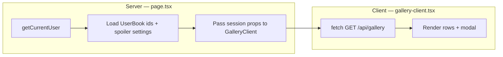
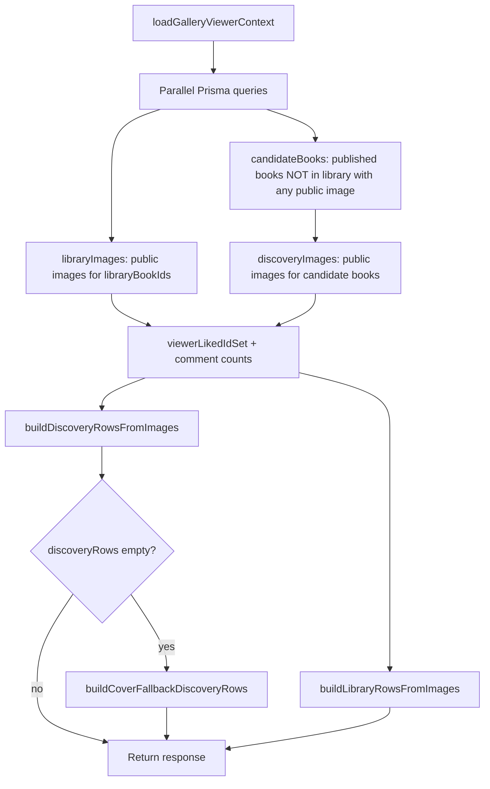
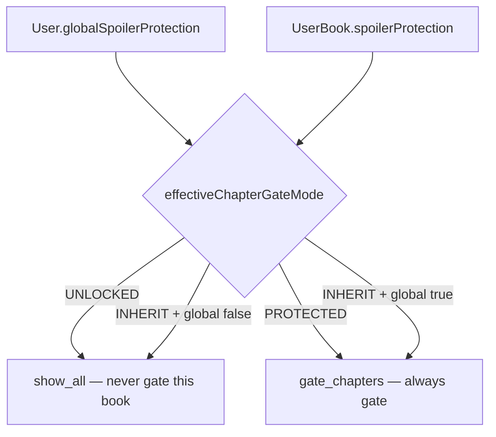

# Public Gallery — technical reference

This document explains how the NovelViz **public gallery** works end to end: where data comes from, how images are selected for each viewer, how spoiler protection is applied differently in each section, and how the client presents the result. It is intended as source material for product documentation.

For a shorter operational overview, see [`gallery-system.md`](./gallery-system.md).

---

## Table of contents

1. [What the public gallery is](#1-what-the-public-gallery-is)
2. [Routes and surfaces](#2-routes-and-surfaces)
3. [Core data model](#3-core-data-model)
4. [Architecture: server vs client](#4-architecture-server-vs-client)
5. [Viewer context: what we know about the visitor](#5-viewer-context-what-we-know-about-the-visitor)
6. [Main API: `GET /api/gallery`](#6-main-api-get-apigallery)
7. [Section: FROM YOUR LIBRARY](#7-section-from-your-library)
8. [Section: DISCOVER](#8-section-discover)
9. [Spoiler protection system](#9-spoiler-protection-system)
10. [Per-book gallery (`/gallery/[bookId]`)](#10-per-book-gallery-gallerybookid)
11. [Client UI (`gallery-client.tsx`)](#11-client-ui-gallery-clienttsx)
12. [Interactions: likes, comments, library actions](#12-interactions-likes-comments-library-actions)
13. [Viewer matrix (who sees what)](#13-viewer-matrix-who-sees-what)
14. [File map](#14-file-map)
15. [Glossary](#15-glossary)

---

## 1. What the public gallery is

The public gallery is a **community showcase of reader-generated images** tied to books. Only images a reader has explicitly marked **public** (`GeneratedImage.isPublic = true`) appear here.

The main page (`/gallery`) is organised as **horizontal book rows**. Each row has:

- A **book anchor** (small cover, title, author, genre pill)
- A **strip of image cards** (community images, optionally blurred/locked)
- In **DISCOVER** rows only: a final **invitation card** encouraging the viewer to add the book to their library or visit the book gallery

Logged-in members with books in their library see two major regions:

| Region | Purpose |
|--------|---------|
| **FROM YOUR LIBRARY** | Community images from books the viewer has added to their library |
| **DISCOVER** | Preview images from books **not** in the viewer's library |

Guests see **DISCOVER only** plus a sign-in banner.

---

## 2. Routes and surfaces

| URL | Server entry | Client | Primary data API |
|-----|--------------|--------|------------------|
| `/gallery` | `app/(public)/gallery/page.tsx` | `gallery-client.tsx` | `GET /api/gallery` |
| `/gallery/[bookId]` | `app/(public)/gallery/[bookId]/page.tsx` | `gallery-book-client.tsx` | `GET /api/gallery/book/[bookId]` |

Styling for the main gallery lives in `app/(public)/gallery/gallery-redesign.css` (scoped under `.gallery-root`).

### Related API routes

| Route | Role |
|-------|------|
| `GET /api/gallery` | Library + discovery rows for main gallery |
| `GET /api/gallery?session=true` | Same, but library images returned with `isLocked: false` (session browsing override) |
| `GET /api/gallery/book/[bookId]` | All public images for one book, each with `isLocked` |
| `GET /api/gallery/book/[bookId]?session=true` | Same, all images unlocked for authenticated non-admin users |
| `POST /api/gallery/[imageId]/like` | Like; re-validates chapter lock server-side |
| `PATCH /api/gallery/[imageId]` | Toggle `isPublic` (owner/admin) |
| `POST /api/library/[bookId]` | Add book to library (used from invitation cards) |
| `PATCH /api/user-books/[bookId]/spoiler-protection` | Per-book spoiler override |

---

## 3. Core data model

### `GeneratedImage`

The gallery only surfaces rows where:

- `isPublic === true`
- Parent `book.status === "published"`
- Parent `book.deletedAt === null`

Relevant fields on each image:

| Field | Gallery use |
|-------|-------------|
| `chapterNumberAtTime` | Chapter the reader was on when the image was generated; **primary input to spoiler gating** |
| `likeCount` | Displayed on cards; updated by like API |
| `isFeatured` | Admin-curated; gold star badge when card is unlocked |
| `userId` | Own-image exception for spoilers; attribution |
| `userPrompt` | Shown in modal when unlocked |
| `imageUrl` | Thumbnail and modal source (blurred client-side when locked) |

### `UserBook` (library membership)

A book appears in **FROM YOUR LIBRARY** when:

```text
UserBook.userId = viewer
UserBook.bookId = book
UserBook.isActive = true
```

`UserBook.spoilerProtection` (`INHERIT` | `PROTECTED` | `UNLOCKED`) overrides account-level spoiler behaviour for that book.

**Important:** Adding a book to the library does **not** create reading progress. Library membership and reading position are separate.

### `ReadingProgress`

```text
ReadingProgress.currentChapterNumber  — highest chapter the reader has saved
```

Created only when the reader saves a chapter (`POST /api/progress/[bookId]`). Gallery spoiler logic reads this value per book.

If no row exists, the reader is treated as **not started** on that book (with special 10% preview rules on the main gallery library section — see below).

### `User.globalSpoilerProtection`

Account default (boolean, default `true`). When `true`, books with `spoilerProtection: INHERIT` use chapter gating.

---

## 4. Architecture: server vs client

The main gallery uses a **split loading model**:



**Server (`page.tsx`)** resolves:

- Whether the visitor is logged in / admin
- `globalSpoilerProtection`, `genrePreferences`
- Active library `bookId`s and per-book `spoilerProtection` map

**It does not load gallery images on the server.**

**Client** fetches the full curated response from `GET /api/gallery` on mount (and again when session reveal toggles). All row building, lock flags, discovery filtering, and comment counts happen in `lib/gallery-page-data.ts` inside that API handler.

This design keeps the gallery page cache-friendly at the HTML layer while allowing personalised curation in the API.

---

## 5. Viewer context: what we know about the visitor

`loadGalleryViewerContext()` in `lib/gallery-page-data.ts` builds a `GalleryViewerContext` used by the API:

| Field | Source | Used for |
|-------|--------|----------|
| `userId`, `role`, `isAdmin` | Session + `User` row | Lock bypass, likes |
| `globalSpoilerProtection` | `User.globalSpoilerProtection` | Spoiler mode resolution |
| `genrePreferences` | `User.genrePreferences` | Discovery row ranking |
| `libraryBookIds` | Active `UserBook` rows | Library vs discovery split |
| `spoilerByBookId` | `UserBook.spoilerProtection` per book | Per-book gate mode |
| `progressByBookId` | `ReadingProgress.currentChapterNumber` | Chapter comparison |
| `progressUpdatedAtByBookId` | `ReadingProgress.updatedAt` | Library row sort order |
| `userBookAddedAtByBookId` | `UserBook.addedAt` | Library row sort tie-break |

Guests use `emptyGuestGalleryContext()` — no user id, empty library, default spoiler on.

---

## 6. Main API: `GET /api/gallery`

**Handler:** `app/api/gallery/route.ts`  
**Builder:** `buildGalleryPageResponse()` in `lib/gallery-page-data.ts`

### Response shape

```typescript
{
  libraryRows: BookGalleryRow[]
  discoveryRows: BookGalleryRow[]
  discoveryMode: "community" | "cover-fallback"
  userGenrePreferences: string[]
  libraryMeta: {
    hasLibraryBooks: boolean
    hasVisibleLibraryImages: boolean
  }
}
```

Each `BookGalleryRow`:

```typescript
{
  bookId, title, author, coverImageUrl, genre
  totalPublicImages: number      // full public count for this book
  isCoverFallback?: boolean      // discover-only synthetic row
  images: GalleryImageCard[]
}
```

Each `GalleryImageCard` includes display fields plus:

```typescript
{
  isLocked: boolean
  lockKind: "none" | "chapter" | "unstarted"
  currentChapterNumber?: number   // viewer progress for this book
  spoilerSetting?: SpoilerProtection
  likedByViewer: boolean
  commentCount: number
}
```

### Query parameters

| Param | Effect |
|-------|--------|
| `session=true` | Library images returned with `isLocked: false`. Ignored for admins (always unlocked). Does not change discovery rows. |

### Build pipeline



### Prisma queries (summary)

**Library images:**

```text
GeneratedImage WHERE isPublic = true
  AND bookId IN viewer.libraryBookIds
  AND book.published AND book.not deleted
ORDER BY createdAt DESC
```

**Discovery candidate books:**

```text
Book WHERE published AND not deleted
  AND id NOT IN viewer.libraryBookIds
  AND has at least one public GeneratedImage
```

**Discovery images:**

```text
GeneratedImage WHERE isPublic = true
  AND bookId IN candidate book ids
ORDER BY createdAt DESC
```

---

## 7. Section: FROM YOUR LIBRARY

**Builder:** `buildLibraryRowsFromImages()`  
**Lock logic:** `memberLock()` (main-gallery-specific)

### Which books appear

A row is emitted for each library book that has **at least one** public community image after the query. Books with zero public images are omitted entirely.

### Row ordering

1. `ReadingProgress.updatedAt` descending (books recently read float up)
2. Tie-break: `UserBook.addedAt` descending

### Which images appear

**All** public images for the book are included in the API response. Unlike an earlier design, locked images are **not** stripped server-side — they are returned with `isLocked: true` and blurred on the client.

### Lock logic (`memberLock`)

Evaluated per image, in order:

| Step | Condition | Result |
|------|-----------|--------|
| 1 | Admin viewer | Unlocked |
| 2 | `session=true` API override | Unlocked |
| 3 | Viewer is image creator | Unlocked |
| 4 | Effective mode is `show_all` | Unlocked |
| 5 | No `ReadingProgress` for book | See **unstarted preview** below |
| 6 | Has progress | Locked if `currentChapter < image.chapterNumberAtTime` |

#### Unstarted preview (library only)

When the viewer has the book in their library but **no saved reading progress**, the main gallery applies a **10% early preview** (same math as discovery):

```text
threshold = ceil(totalChapters × 0.10)

if image.chapterNumberAtTime <= threshold → unlocked
else → locked, lockKind = "unstarted"
```

**Example:** Book with 430 chapters → threshold = 43. Chapter 1 image unlocked; chapter 43 image unlocked at threshold boundary; chapter 44+ locked.

When progress **is** saved, gating uses strict chapter comparison only (`lockKind: "chapter"` for images ahead of the reader).

#### Lock kinds

| `lockKind` | Meaning |
|------------|---------|
| `none` | Fully visible |
| `unstarted` | No reading progress; image beyond 10% preview |
| `chapter` | Has progress; image from a chapter the reader has not reached |

### Client presentation

- **Unlocked cards:** full image, optional corner padlock badge (colour indicates spoiler state), featured star if applicable
- **Locked cards:** `blur-[24px]` on image, centred lock icon overlay, chapter number label, likes disabled
- **Modal:** locked cards open a blurred modal with unlock / add-to-library CTAs; excluded from swipe carousel

### Empty states (client)

| Condition | Message |
|-----------|---------|
| Not logged in | Section hidden |
| `hasLibraryBooks === false` | CTA to discover books |
| `hasVisibleLibraryImages === false` | No community images yet for library books |
| Genre filter active, no matches | No library books match genre |

`hasVisibleLibraryImages` is `libraryRows.length > 0` (at least one library book with public images).

---

## 8. Section: DISCOVER

**Builder:** `buildDiscoveryRowsFromImages()`  
**Fallback:** `buildCoverFallbackDiscoveryRows()` when no community discovery rows qualify

### Purpose

Surface books the viewer has **not** added to their library, showing a **small, non-spoiler preview** of community art to encourage exploration and library adds.

### Book selection

1. Start from published, non-deleted books **not** in viewer's active library
2. Book must have at least one public `GeneratedImage`
3. Rank by:
   - Genre match with viewer's `genrePreferences` (preferred)
   - Count of qualifying preview images (more preview images rank higher)
4. Cap at **5 rows** (`DISCOVERY_ROW_LIMIT`)

### Image selection — the 10% rule

Discovery uses the same threshold function as library unstarted preview:

```typescript
discoveryChapterThreshold(totalChapters) = ceil(totalChapters × 0.10)
```

Only images where:

```text
chapterNumberAtTime <= threshold
```

are included in the row. **`totalPublicImages`** on the row still reflects the **full** public count (used for invitation card copy).

Admins see all public images in discovery rows (no chapter cap).

### Discovery cards and spoilers

Discovery preview images are always returned with:

```text
isLocked: false
lockKind: "none"
```

Spoiler gating is enforced by **not including** later-chapter images at all, rather than returning them blurred.

### Invitation card (last card in each strip)

Rendered by `InvitationCard` in `components/gallery/gallery-book-row.tsx`.

**Community discovery** (has preview images):

| Element | Behaviour |
|---------|-----------|
| Heading | `"X more image(s) inside"` where `X = max(1, totalPublicImages - images.length)` |
| Card click | Navigate to `/gallery/[bookId]?from=gallery` |
| **+ Add to library** button | `POST /api/library/[bookId]` with `{ spoilerProtection: "PROTECTED" }`, then refetch gallery |
| Guest button | Links to `/login` |

**Cover fallback** (no qualifying community images; see below):

| Element | Behaviour |
|---------|-----------|
| Single preview card | Book's AI-generated cover with "Cover" badge |
| Cover card click | `/discover/[bookId]?from=gallery` (book catalogue page) |
| Invitation heading | `"Explore this book"` |
| Invitation card click | Same — `/discover/[bookId]?from=gallery` |
| **+ Add to library** button | Same as community discovery |

### Cover fallback mode

When `buildDiscoveryRowsFromImages()` returns zero rows, the API tries `buildCoverFallbackDiscoveryRows()`:

- Selects up to 5 published books with `coverIsAiGenerated = true` and a cover URL
- Excludes library books
- Sorts by genre preference match, then `book.updatedAt`
- Each row has `isCoverFallback: true` and a **synthetic** image card (id prefix `gallery-cover:`)

`discoveryMode` in the API response becomes `"cover-fallback"` so the client can show explanatory copy.

### Genre filtering

Genre pills are **client-side only** — they filter already-loaded rows by `row.genre` without refetching.

---

## 9. Spoiler protection system

### Settings hierarchy



**Implementation:** `effectiveChapterGateMode()` in `lib/gallery-spoiler.ts`

| `UserBook.spoilerProtection` | Effective mode |
|------------------------------|----------------|
| `UNLOCKED` | `show_all` |
| `PROTECTED` | `gate_chapters` |
| `INHERIT` | `gate_chapters` if `globalSpoilerProtection === true`, else `show_all` |

### Chapter comparison (`gate_chapters` mode)

```typescript
isChapterBehindLock(mode, currentChapter, imageChapter):
  if mode === "show_all" → false
  if currentChapter === undefined → true   // used by per-book gallery & like API
  return currentChapter < imageChapter
```

`isGalleryImageChapterLocked()` adds exceptions: admin never locked; viewer's own images never locked.

### Where rules differ

| Surface | No progress behaviour | Ahead-of-reader images |
|---------|----------------------|------------------------|
| Main gallery — **library** | 10% preview unlock via `memberLock` | Returned locked, blurred |
| Main gallery — **discover** | N/A (not in library) | Excluded from response if above 10% |
| Per-book gallery | All community images locked | Returned locked, blurred |
| Like API | Uses `isGalleryImageChapterLocked` (no 10% unstarted preview) | Blocked unless discovery preview exception |

**Note:** The like API uses `isGeneratedImageChapterLockedForViewer()` which does **not** replicate the library unstarted 10% preview. A library image visible via unstarted preview may still be un-likable until progress is saved or session reveal is active. Discovery preview likes use a separate exception (`isDiscoveryPreviewLikeAllowed`).

### Session reveal ("Showing spoilers")

`GallerySpoilerSelect` toggles `gallerySessionRevealAll` in the client, which refetches `GET /api/gallery?session=true`.

- Library images return with `isLocked: false`
- Trust model: client-declared; likes pass `sessionBrowsingUnlockedBookIds: [bookId]` in the like POST body
- Resets on gallery page mount
- Admins never need session reveal

### Permanent per-book unlock

- `PATCH /api/user-books/{bookId}/spoiler-protection` with `{ setting: "UNLOCKED" }`
- Or `POST /api/library/{bookId}` with `{ spoilerProtection: "UNLOCKED" }` if not yet in library

### Visual indicators on unlocked library cards

`resolveLibraryPadlockBadge()` — corner badge on **unlocked** cards only:

| Colour | Meaning |
|--------|---------|
| Aqua | Viewer's own image |
| Green | Chapter gate active; image within reading progress |
| Yellow | Spoiler protection effectively off (global off + inherit/unlocked) |
| Red | Book set to `UNLOCKED` while account still has global protection on |

Locked cards show a **centred lock icon** overlay instead of corner badges.

---

## 10. Per-book gallery (`/gallery/[bookId]`)

A dedicated grid of **all** public images for one book.

### Data loading

```text
fetch(`/api/gallery/book/${bookId}${sessionReveal ? "?session=true" : ""}`)
```

### Lock behaviour differences from main gallery

| Viewer | Behaviour |
|--------|-----------|
| Guest | All images `isLocked: false` (no personalised gating) |
| Admin or `?session=true` | All images unlocked |
| Member | `isGalleryImageChapterLocked` per image — **no** library unstarted 10% preview |

For members with no reading progress, **all** community images on the per-book gallery are locked (guests excepted).

### Session reveal

Same dropdown component as main gallery when the book is in the user's library. Toggling refetches with `?session=true`.

---

## 11. Client UI (`gallery-client.tsx`)

### Initial props (from server page)

```typescript
{
  isLoggedIn, isAdmin, viewerUserId
  globalSpoilerProtection, genrePreferences
  libraryBookIds, spoilerSettingsByBookId
  viewerDisplayName
}
```

### Key state

| State | Purpose |
|-------|---------|
| `libraryRows`, `discoveryRows` | API row data |
| `discoveryMode` | `"community"` vs `"cover-fallback"` banner |
| `libraryMeta` | Empty-state flags |
| `selectedGenre` | Client filter |
| `gallerySessionRevealAll` | Session spoiler override |
| `imagesById` | Flat map for modal + optimistic likes |
| `modalState` | Open image + carousel index |

### Modal carousel

`modalCarouselIds` collects ids of **unlocked** images across filtered library + discovery rows. Locked images open the modal via a single-id fallback but are not in the swipe carousel.

### Modal behaviour

| Locked | Unlocked |
|--------|----------|
| Blurred image + lock shade | Full image |
| No prompt disclosure | Prompt disclosure |
| No comments sidebar | Comments sidebar |
| Unlock / add-to-library CTAs | Like, share, link to per-book gallery |

Modals portal to `document.body` via `GalleryImageModalShell` (required because `.gallery-root` uses `isolation: isolate`).

### Header (members only)

- Badge legend (padlock colours)
- `GallerySpoilerSelect` — toggles session reveal

---

## 12. Interactions: likes, comments, library actions

### Likes

`POST /api/gallery/[imageId]/like`

Blocked when:

- Not logged in
- Own image
- Image chapter-locked per `isGeneratedImageChapterLockedForViewer`
- Already liked

Allowed despite lock when:

- Admin
- Book id in `sessionBrowsingUnlockedBookIds` from client
- `isDiscoveryPreviewLikeAllowed` — book **not** in library and image within 10% threshold

### Comment counts on cards

`viewerVisibleCommentCountByImageIds()` applies the same visibility rules as the comments API, including spoiler-flagged comments gated by chapter progress.

### Add to library (discovery)

From invitation card or locked modal:

```http
POST /api/library/[bookId]
{ "spoilerProtection": "PROTECTED" }
```

After success, gallery refetches — book moves from DISCOVER to FROM YOUR LIBRARY on next load.

---

## 13. Viewer matrix (who sees what)

| Viewer | FROM YOUR LIBRARY | DISCOVER | Spoiler on library images |
|--------|-------------------|----------|---------------------------|
| Guest | Hidden | Up to 5 rows; invitation → login | N/A |
| Member, empty library | Empty state CTA | Discovery rows | N/A |
| Member, library books | Rows per book; locked images blurred | Non-library books only | `memberLock` + 10% unstarted preview |
| Member, session reveal | All library images unlocked in API | Unchanged | Off for display |
| Admin | All unlocked | All preview images (no 10% cap) | Never locked |

---

## 14. File map

| File | Responsibility |
|------|----------------|
| `app/(public)/gallery/page.tsx` | Session props only |
| `app/(public)/gallery/gallery-client.tsx` | Main gallery UI, fetch, modal, filters |
| `app/(public)/gallery/gallery-book-client.tsx` | Per-book gallery UI |
| `app/api/gallery/route.ts` | Main gallery API entry |
| `lib/gallery-page-data.ts` | Viewer context, row builders, discovery threshold, `memberLock` |
| `lib/gallery-spoiler.ts` | Gate mode resolution, lock predicates |
| `lib/gallery-image-lock-server.ts` | Like API lock check |
| `lib/gallery-types.ts` | Shared TypeScript types |
| `lib/gallery-card-spoiler-badge.ts` | Corner padlock badge colours |
| `lib/gallery-comment-counts.ts` | Visible comment counts |
| `components/gallery/gallery-book-row.tsx` | Book row layout, invitation card, locked overlay |
| `components/gallery/gallery-spoiler-select.tsx` | Session reveal dropdown |
| `components/gallery/modal-image-swipe-view.tsx` | Modal image pane + lock shade |

---

## 15. Glossary

| Term | Definition |
|------|------------|
| **10% threshold** | `ceil(totalChapters × 0.10)` — max chapter number included in discovery previews and library unstarted previews |
| **Chapter gate** | Hide/blur images from chapters the reader has not reached |
| **Discovery preview** | Images shown in DISCOVER before the book is in the viewer's library |
| **Invitation card** | Blurred cover card at end of discovery strip with add-to-library CTA |
| **Library row** | Horizontal strip of images for one book in FROM YOUR LIBRARY |
| **Lock kind** | Server metadata describing why an image is locked (`unstarted` vs `chapter`) |
| **Session reveal** | Temporary client/API override that shows all library images unlocked |
| **Unstarted preview** | Library-member preview of early-chapter images before reading progress is saved |

---

## Related documentation

- [`gallery-system.md`](./gallery-system.md) — condensed operational reference
- [`commenting-system.md`](./commenting-system.md) — comment visibility and spoiler comments
- [`sign-up-onboarding.md`](./sign-up-onboarding.md) — username and genre preferences at onboarding
