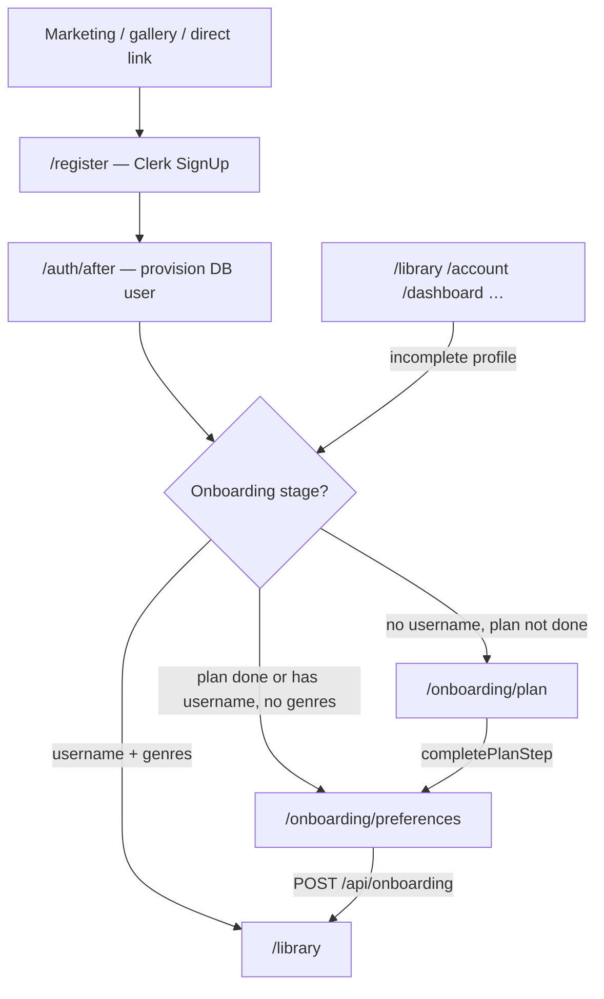

# Sign-up and onboarding

This document describes the **new user sign-up and onboarding flow** for NovelViz: what the user sees, what happens behind the scenes, and how the app decides where to send someone next.

For Clerk configuration, webhooks, and local dev impersonation, see also [auth-workflow.md](./auth-workflow.md).

---

## Summary

Sign-up is handled in **separate steps across multiple routes**, not a single in-app wizard:

1. **Clerk registration** — account creation (email/password or social, per Clerk settings)
2. **Account provisioning** — wait for a NovelViz `User` row in the database
3. **Plan selection** — choose Free, Standard, or express Partner interest (Premium is shown as coming soon)
4. **Profile preferences** — username, genres, optional demographics, mailing list opt-in
5. **Library** — reader app home once onboarding is complete

**Completion rule:** a user is considered onboarded when they have **both** a **username** and **at least one genre preference** stored on their `User` record.

---

## User flow (what the reader sees)

### Step 1 — Create account (`/register`)

- The user opens **Sign up** from marketing pages, gallery guest prompts, or `/register` directly.
- A single NovelViz form collects **email**, **password**, and required **legal agreements** (18+, Terms, Privacy) in conventional order — all fields are editable immediately; **Create account** stays disabled until everything is valid.
- After submit, the user enters the **email verification code** on the same page (Clerk sends the code; no embedded Clerk widget).
- Once verified, consent is saved to the database and the user goes straight to **`/onboarding/plan`** (no `/auth/consent` detour on the happy path).
- Legacy URL `/sign-up` redirects to `/register`.
- If someone already signed in visits `/register`, they are sent to the appropriate next step (onboarding or library), not shown sign-up again.

**Sign-in** still uses Clerk’s widget at `/login` and routes through `/auth/after`.

### Step 2 — Setting up account (`/auth/after`)

- Used primarily after **sign-in** at `/login` (and as a fallback if provisioning is slow).
- A short **“Setting up your account…”** screen appears while the app ensures a database user exists.
- The page polls `GET /api/auth/session-ready` (no full-page reload loop) until provisioning succeeds, then redirects automatically.
- If provisioning takes too long, the user sees a link to try signing in again at `/login`.

### Step 3 — Choose your plan (`/onboarding/plan`)

- Headline: **“How would you like to read?”**
- Four cards are shown:
  - **Free** — limited monthly Q&A and images
  - **Standard** — higher limits; during beta, Standard features are free
  - **Premium** — displayed as **Coming soon** (not selectable)
  - **Partner** — for authors/publishers; **Request access** submits a partner interest request
- The user selects a reader plan (Free or Standard) and confirms via that card’s button, or requests Partner access from the Partner card.
- A footer note explains beta behaviour: during beta all accounts use Standard features at no charge; after beta, accounts revert to Free unless upgraded.

**After plan selection**, the user goes to `/onboarding/preferences`.

### Step 4 — Setup your profile (`/onboarding/preferences`)

- Headline: **“Setup your Profile”** (shimmering title).
- Required:
  - **Username** — 3–20 characters, letters, numbers, underscores; checked live for availability
  - **Genre preferences** — at least one genre pill must be selected
- Optional:
  - Gender, age range, country
  - Mailing list checkbox
- Submitting **Get Started** saves the profile and sends the user to **`/library`**.

### Step 5 — Library (`/library`)

- Normal reader experience with app navigation.
- Users who try to open `/library`, `/account`, `/dashboard`, etc. **before** finishing onboarding are redirected back to the correct onboarding step.

### Returning users (sign-in, not sign-up)

- **`/login`** — Clerk sign-in (legacy `/sign-in` redirects here when signed out).
- After sign-in, **`/auth/after`** runs the same routing logic:
  - Profile complete → `/library` (or role-appropriate home)
  - Profile incomplete → correct onboarding step (`/onboarding/plan` or `/onboarding/preferences`)

---

## Flow diagram

---

## Onboarding stage logic (technical)

Stage calculation lives in [`lib/session-profile.ts`](../lib/session-profile.ts) as `getOnboardingStage()`.

| Stage | Condition |
|-------|-----------|
| **`plan`** | No genre preferences **and** no username **and** plan cookie **not** set |
| **`preferences`** | No genre preferences **but** username exists **or** plan cookie **is** set |
| **`complete`** | Username is set **and** at least one genre preference exists |

Redirect helpers:

- `getOnboardingRedirectUrl()` — sends user to `/onboarding/plan`, `/onboarding/preferences`, or `/library`
- `getPostAuthRedirectUrl()` — used after Clerk; equivalent to onboarding redirect **without** treating the plan cookie as complete (fresh sign-up always hits plan first unless profile already partially filled)

Legacy route **`/onboarding`** (no UI) reads the session and redirects to the correct step.

---

## Plan step bridge cookie

Because username is only collected on the preferences page, the plan step uses a short-lived cookie so preferences remains reachable **before** a username exists:

| Cookie | Name | Set by | Cleared by | Purpose |
|--------|------|--------|------------|---------|
| Plan step done | `onboarding_plan_done=1` | `completePlanStep` server action | Preferences submit (`clearPlanStepCompleteCookie`) | Marks plan step complete for stage routing |

- Max age: **24 hours**
- SameSite: **Lax**
- Defined in [`lib/onboarding-cookies.ts`](../lib/onboarding-cookies.ts)

Without this cookie, a user who finished plan selection but has no username would be sent back to `/onboarding/plan`.

---

## Routes and UI components

| URL | Type | Main files | Auth required |
|-----|------|------------|---------------|
| `/register` | Public | [`app/register/[[...rest]]/page.tsx`](../app/register/[[...rest]]/page.tsx), [`components/clerk-themed-auth.tsx`](../components/clerk-themed-auth.tsx) | No (redirect if already signed in) |
| `/login` | Public | Clerk SignIn | No |
| `/auth/after` | Post-auth | [`app/auth/after/page.tsx`](../app/auth/after/page.tsx), [`auth-after-provisioning.tsx`](../app/auth/after/auth-after-provisioning.tsx) | Yes (Clerk) |
| `/onboarding/plan` | Onboarding | [`plan/page.tsx`](../app/(reader)/onboarding/plan/page.tsx), [`plan-client.tsx`](../app/(reader)/onboarding/plan/plan-client.tsx) | Yes |
| `/onboarding/preferences` | Onboarding | [`preferences/page.tsx`](../app/(reader)/onboarding/preferences/page.tsx), [`preferences-client.tsx`](../app/(reader)/onboarding/preferences/preferences-client.tsx) | Yes |
| `/onboarding` | Router only | [`onboarding/page.tsx`](../app/(reader)/onboarding/page.tsx) | Yes |
| `/library` | Reader app | Blocked until onboarding complete | Yes |

Shared onboarding shell styling: [`app/(reader)/onboarding/onboarding.css`](../app/(reader)/onboarding/onboarding.css), [`onboarding/layout.tsx`](../app/(reader)/onboarding/layout.tsx).

Clerk global URLs are set in [`app/layout.tsx`](../app/layout.tsx): `signInUrl="/login"`, `signUpUrl="/register"`.

---

## Server actions and APIs

### Plan selection — `completePlanStep`

- **File:** [`lib/onboarding-plan-action.ts`](../lib/onboarding-plan-action.ts)
- **Called from:** plan page client (`PlanClient`)
- **Requires:** authenticated session
- **Actions:**
  1. Sets `User.subscriptionTier` to `free`, `standard`, or `premium` (Premium is not offered in UI today)
  2. Calls `establishLimitFloorsForTier()` for usage limits
  3. If **Partner interest**: creates a `PartnerRequest` row (deduped per user) with onboarding markers
  4. Sets `onboarding_plan_done` cookie
- **Client redirect:** `window.location.assign("/onboarding/preferences")`

Plan tier display data is loaded from admin-configured **`TierLimitConfig`** via `getPublicTierPlans()`. Credit pack prices on plan cards come from the first active **`CreditPack`** row.

### Profile completion — `POST /api/onboarding`

- **File:** [`app/api/onboarding/route.ts`](../app/api/onboarding/route.ts)
- **Requires:** authenticated session
- **Validates:** username format, genre list (enum values), optional gender/age/country, mailing list flag
- **Persists:** `username`, `genrePreferences`, optional profile fields on `User`
- **Errors:** `409` if username taken; `400` if validation fails or profile already complete
- **Client redirect:** `/library` after success; plan cookie cleared on client

### Username availability — `GET /api/onboarding/check-username`

- **File:** [`app/api/onboarding/check-username/route.ts`](../app/api/onboarding/check-username/route.ts)
- **Auth:** none (public read-only check)
- **Query:** `?username=...`
- **Returns:** `{ valid, available }`
- Username rules: [`lib/username.ts`](../lib/username.ts) — `/^[a-zA-Z0-9_]{3,20}$/`

---

## Database user provisioning

A NovelViz **`User`** row (linked by `clerkId`) must exist before onboarding pages can load meaningful data.

| Mechanism | When | File |
|-----------|------|------|
| **Clerk webhook** | `user.created` event | [`app/api/webhooks/clerk/route.ts`](../app/api/webhooks/clerk/route.ts) |
| **Fallback upsert** | First `getCurrentUser()` / `ensureCurrentUser()` after Clerk sign-in | [`lib/auth.ts`](../lib/auth.ts) (`ensureDbUserForClerk`) |

New users created via upsert/webhook get:

- Email and name from Clerk
- Default **`usagePeriodAnchor`** from sign-up day (capped at 28 for billing alignment)
- Default role **reader** (unless changed elsewhere)

---

## Access control and redirects

### Middleware (`proxy.ts`)

Clerk middleware protects app routes including `/onboarding(.*)`, `/library(.*)`, `/account(.*)`, etc.

In **development only**, a valid `dev_user_id` cookie can satisfy protection without Clerk (role switcher). This bypass does **not** exist in production.

### Reader layout (`app/(reader)/layout.tsx`)

All onboarding routes under `(reader)` require:

1. Clerk session (or dev cookie in local dev)
2. A resolved `User` via `ensureCurrentUser()` — otherwise redirect to `/auth/after`

### Reader app shell (`app/(reader)/(app)/layout.tsx`)

Routes like `/library` additionally require **completed onboarding** (`username` + genres). Incomplete users are redirected via `getOnboardingRedirectUrl()`, respecting the plan cookie.

---

## Partner plan during sign-up

The Partner card is a **reader onboarding** surface, not a separate account type at sign-up:

- Clicking **Request access** on the Partner card runs `completePlanStep({ tier: "standard", partnerInterest: true })`.
- That sets the subscription tier to Standard, creates a **`PartnerRequest`** if one does not already exist for this onboarding flow, then continues to preferences like a normal Standard selection.
- Partner approval and partner-role assignment happen **outside** this flow (admin/process).

---

## Legacy and edge cases

| Scenario | Behaviour |
|----------|-----------|
| User has **username** but **no genres** (legacy account) | Preferences page in **genres-only** mode: username field read-only, genres required |
| User completes profile then hits onboarding URLs | Redirect to `/library` |
| Signed-in user opens `/register` | Redirect to post-auth destination |
| `/sign-in` while signed out | Redirect to `/login` |
| `/sign-in` while signed in | Post-auth redirect (onboarding or library) |
| Premium tier in plan UI | Shown as **Coming soon**; cannot be selected |

---

## Design preview (development only)

For local UI work without creating accounts repeatedly:

- **`/dev/onboarding-preview`** — steps through Register (iframe), Provisioning, Plan, and Preferences with Back/Forward controls
- **404 in production**
- Plan and preferences use **`previewMode`**: no server writes or redirects; register iframe is live Clerk (do not complete sign-up unless intentional)

---

## Manual test checklist

Use this when updating site manuals or verifying releases:

1. **New sign-up:** `/register` → complete Clerk → `/auth/after` → `/onboarding/plan` → select Free or Standard → `/onboarding/preferences` → username + genre → `/library`
2. **Partner interest:** From plan page, Partner **Request access** → preferences → library; confirm `PartnerRequest` created in admin
3. **Username taken:** Try duplicate username on preferences; inline error and API `409`
4. **Incomplete guard:** Sign up, stop after plan; manually open `/library` → redirected to preferences (with plan cookie) or plan (without)
5. **Returning user:** `/login` with completed profile → `/library` directly after `/auth/after`
6. **Sign out:** Account menu → home; protected routes require sign-in again
7. **Mobile:** Plan cards stack single column; preferences form usable without horizontal scroll; provisioning loader does not force extra page scroll

---

## Related documentation

- [auth-workflow.md](./auth-workflow.md) — Clerk URLs, webhooks, dev switcher, deploy checklist
- [payment-credit-system-report.md](./payment-credit-system-report.md) — subscription tiers, limits, and credit packs referenced on plan cards
- [quota-and-credit-plan.md](./quota-and-credit-plan.md) — product rules for tiers and overage
